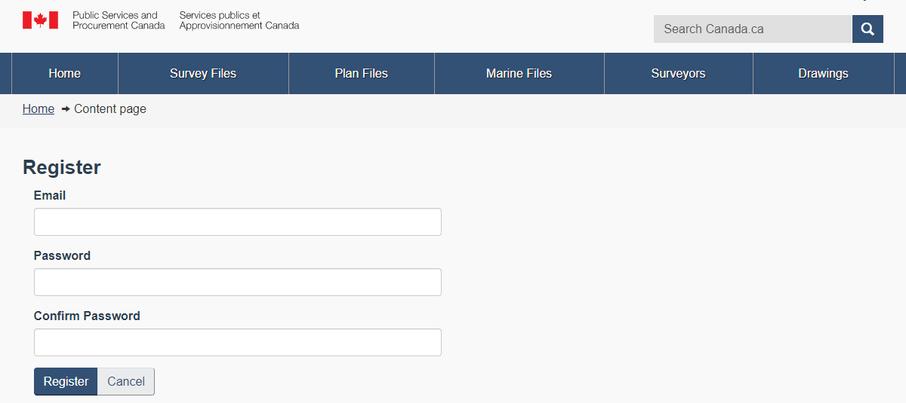

# LAND INFO - DEV DIARY
Jordan Chiu - Summer 2019

This report is best viewed in a desktop markdown editor, such as [Typora](https://typora.io/).

[TOC]

# Introduction

In summer 2019, I was tasked with the modernization of an old database application used by Pacific Region Geomatics called the Land Info Database Manager.  It was created in 2011 using Ruby on Rails, but needed to be rewritten in a more maintainable tech stack that was on the department’s technology road-map.  This project would require us to build a full-stack application from the ground up.  While the application was ostensibly a fairly simple CRUD application, we had a fairly short time frame to complete this project: a total of 21 days including project management and testing.

The main developers on this project were myself ([Jordan Chiu](mailto:jordanmchiu@gmail.com)) and [Matty Wong-Rose](mailto:mathieu.wong-rose@pwgsc-tpsgc.gc.ca), who was also responsible for project management.  Additional advising, assistance, and code review came from [Ryan Seo](mailto:ryan.seo@pwgsc-tpsgc.gc.ca).

The purpose of this document is twofold.  First, it will detail the design process of this application, including any challenges that we came across during development, the reasoning behind any of the decisions made, and any lessons learned through the process.  Secondly, it will serve as my co-op report for the term, prove that I actually did do work here, and thereby allow me to graduate from the program.  😛

This is **not** meant to be read from back to front (though you can if you want to).  It's meant to serve as a potentially helpful guide to answer questions like, "What does this do?" or "Why was this decision made?"

Another note: some images are hidden to ensure the integrity of the information in the database.  Anything visible is developer-generated test data.

## Initial Project Timeline

We estimated that the project would be broken down into the following components, each taking a set amount of work days to complete.

| Estimates              | Days (estimated) |
| ---------------------- | ---------------- |
| Requirements gathering | 1                |
| Data migration         | 1                |
| Data modeling          | 1                |
| Authentication         | 1                |
| Search functionality   | 3                |
| Front-end              | 8                |
| Dev testing            | 2                |
| User testing support   | 1                |
| Server configuration   | 1                |
| Project management     | 2                |
| TOTAL                  | 21               |

## Technology Stack
Choosing the technology for the back-end architecture for this project was very simple.  The Digital Services Branch (DSB) already had several successful applications running that used .NET Core MVC, including the Billing and Booking apps for the Esquimalt Graving Dock (EGD).  Each app was well-organized into different components, making it easy to fix bugs, make modifications, and write extensions for the projects.  Since we were already familiar with the technology and knew that it worked well, choosing to use .NET Core MVC was not a difficult decision.

In order to ensure that we were using technologies approved by our department, we needed to perform a database migration onto a production server.  The old Land Info app was written in MySQL, but our development and production servers ran MS SQL.  Fortunately, migration was fairly simple with a migration assistant program, detailed more fully below.

Finally, we needed to decide on a front-end framework for this project.  Being a Government of Canada project, we would need to use the WET Core Framework for look and feel.  We wanted to make this application as maintainable as possible while trying to keep it modern.  Because of this, we decided against using .NET Core Views and instead chose to create a (single-page) Vue.js application, using our back-end controllers as REST endpoints to allow for a more dynamic application.

In summary, the technologies we planned to use include:
- Database
  - MS SQL
- Back-end
  - ASP.NET Core MVC (C#)
  - LINQ (for database queries)
- Front-end
  - WET Core Framework
  - Axios
  - Vue.js
  - Lodash
  - Vuex (maybe?)

# Part 1: Database Migration (Transmogrification?)

JIRA tasks:

Before doing anything else, we needed to migrate the Land Info database from MySQL to MS SQL Server.  Fortunately, Microsoft has a SQL Server Migration Assistant tool that makes migration to SQL Server fairly simple.  I simply logged on to the remote server via a remote connection and performed the data migration, transferring the data to ```land_info.dbo``` on remote.  I also created a backup copy of the database on the same server to make sure we didn't lose any of our progress.

Of course, there’s no such thing as a free lunch.  We encountered a small problem in the migration, where the Migration Assistant ignored character limits on full-text indexes.  We came across the following problem in three tables: drawings, plan_files, and survey_files.


There were two possible solutions to this problem that I came up with:

> 1. Use a ```FULLTEXT``` index for the description field
>    - Advantages:
>      - May improve performance for very large datasets
>    - Disadvantages:
>      - Eventual production SQL server (and current development server) may not support SQL Server Full Text Search
>      - Original MySQL only indexes on first few characters of each description
>      - Landinfo database is probably not large enough to warrant implementing full text search: https://docs.microsoft.com/en-us/previous-versions/sql/sql-server-2005/administrator/cc917695
> 2. Create a new persisted computed column called ```description_abbr``` in each table which contains the first 20-40 characters of the description field, depending on original database specifications, and index on that column: https://stackoverflow.com/questions/4028868/create-index-on-partial-char-column
>    - Advantages:
>      - Simpler, doesn't require additional SQL Server architecture to implement
>      - More closely emulates original database
>    - Disadvantages:
>      - Each entry will take up extra space (22 to 42 bytes per entry depending on length of abbreviated index)

We decided to proceed with solution 2 for the reasons stated above.  Using Visual Studio’s Server Explorer tool, I created persisted computed columns that contained the first 20 to 40 characters of each description, depending on how many characters were used for the index in the original database schema.  An example of such a statement is here:

```sql
alter table <table_name> add description_abbr as cast(description as varchar(20)) persisted;
```
After migrating over the tables, we discovered that there were *no foreign keys* anywhere in the original schema:


To create a more robust system, we decided to add these references in the updated schema.  But first, we wanted to create our back-end models in the project so that any updates to the database would be reflected in our project.

# Part 2: Model Creation + Basic Scaffolding

### Models

In order to make sure that any changes we made to our database could be easily captured and reflected in our project, we decided to create scaffolds for our back-end data in our .NET Core project.  Like everything else in coding, there was a tutorial for this.  We set up an MVC web application in Visual Studio and used ```land_info.dbo``` as our scaffold: https://docs.microsoft.com/en-us/ef/core/get-started/aspnetcore/existing-db

### Controllers

After the model creation was complete, we moved on to scaffolding the rest of the project: controllers, views, and repositories.  This was also fairly simple: Visual Studio has a tool that allows you to easily create controllers and their associated views based on existing models.

We ended up creating **controllers** for each of the models that were present in the original application:

* DrawingsController
* FeaturesController
* LandDistrictsController
* LocationsController
* MarineFilesController
* PlanFilesController
* ProvincesController
* RegionsController
* SurveyFilesController
* SurveyorsController

There were also three other controllers that we had as helpers that we knew we would need later:

* AccountController (for user authentication)
* HomeController
* PrintController (for printing out data, pages, etc.)

### Context

Next, we needed to deal with the project context files.  When we started up the fresh .NET Core project, it automatically provided us with interfaces for authentication and user management.  It also generated a project context for us: `ApplicationDbContext`.

But our database already had a `users` table as well as its own context, `LandInfoContext`.  Trying to add migrations in the NuGet package manager resulted in errors from having two different contexts in the same project.  The natural solution was to merge the two contexts into one.  In order to do this, we:

1. Removed the `users` DbSet from `LandInfoContext`.  This would mean that any future users would have to create new accounts if they wanted to use the new application.  (This was probably desirable, since the old application had no obvious ability to register new users or have users change their passwords.)
2. Changed `LandInfoContext` to extend the `IdentityDbContext` interface.
3. Moved the code in `ApplicationDbContextModelSnapshot.BuildModel()` to `LandInfoContextModelSnapshot.BuildModel()`.  This would allow creation of the proper AspNetUser tables when the database was updated.
4. Removed `ApplicationDbContext` and its associated model snapshot from the app.
5. Added the migration and, after making sure we didn't get any errors, updated the database.

We chose not to add models for user authentication until a later time, when we already had the application up and running.

### Repositories

Something that we wanted to emulate from the EGD Billing application was the abstraction of database access through the use of repositories.  When Visual Studio automatically generates controllers from existing models, the controller methods access the project context directly.  This isn't the best solution for extensibility and code reuse, so we decided to create repositories and their associated interfaces to make do database updates for us.  You can view these repositories in the `Services` folder of the project.

First, we needed to create an interface for a database Entity.  For our purposes, the only thing a database entity needs is an integer ID:

```csharp
// IEntity.cs

namespace LandInfoNetCore.Services.Interfaces
{
    public interface IEntity
    {
        int Id { get; set; }
    }
}
```

Next, we needed to create a class that contained all of the common database methods: Adders, Getters, Updaters, and Deleters.  We called this `GenericRepository`:

```csharp
// GenericRepository.cs

namespace LandInfoNetCore.Services
{
    /// <summary>
    ///     Generic repository can only be used for entities 
    ///     that have a unique ID property of "Id", and its type
    ///     must be an integer.
    /// </summary>
    /// <typeparam name="TEntity">Entity</typeparam>
    /// <typeparam name="TKey">Primary key of the entities</typeparam>
    public class GenericRepository<TEntity, TKey> : IRepository<TEntity, int> where TEntity : class, IEntity
    {
        private readonly LandInfoContext _context;

        public GenericRepository(LandInfoContext context)
        
            _context.Set<TEntity>().Add(entity);
            _context.SaveChanges();
        }
        
        /// ...
        /// More methods here.
    }
}   
```

As implied by this class, we also needed to create an interface for a generic repository that contained method signatures for all methods.  We called this interface `IRepository`:

```csharp
// IRepository.cs

namespace LandInfoNetCore.Services.Interfaces
{
    /// <summary>
    ///     Generic interface that should be implemented 
    ///     for all repository pattern classes.
    ///     We don't need to use IDisposable, as the
    ///     repositories that implement this interface will be
    ///     managed by dependency injection. Lifecycle will be controlled by it.
    /// </summary>
    /// <typeparam name="T">Entity</typeparam>
    public interface IRepository<TEntity, TKey>
    {
        /// <summary>
        /// Add an entity to the database.
        /// </summary>
        /// <param name="entity">Entity</param>
        void Add(TEntity entity);
        
        /// ...
        /// More signatures here.
    }
}   
```

The next step was to create interface for each of the specific controllers that needed to access the database.  For now, we kept the interface a skeleton, but we could easily add method declarations to allow for specific implementations later on.  Here's an example of one such skeleton interface for Drawings:

```csharp
// IDrawingsRepository.cs

namespace LandInfoNetCore.Services.Interfaces
{
    public interface IDrawingsRepository : IRepository<Drawing, int>
    {
    }
}
```

Finally, we needed to create concrete implementations for these repositories.  Again, they were only skeletons, but we could easily override any `GenericRepository` methods and add our own if desired.  Here's an example of one such repository class:

```csharp
// DrawingsRepository.cs

namespace LandInfoNetCore.Services
{
    public class DrawingsRepository :
        GenericRepository<Drawing, int>,
        IDrawingsRepository
    {
        private readonly LandInfoContext _context;

        public DrawingsRepository(LandInfoContext context) : base(context)
        {
            _context = context;
        }
    }
}
```

But we weren't done!  We had to head back to the controllers with all the calls to `LandInfoContext` and change those to call repository interfaces instead.  Here's an example of what a controller looked like after we updated it:

```csharp
// DrawingsController.cs

namespace LandInfoNetCore.Controllers
{
    public class DrawingsController : Controller
    {
        private readonly IDrawingsRepository _drawingsRepository;

        public DrawingsController(
            IDrawingsRepository drawingsRepository)
        {
            _drawingsRepository = drawingsRepository;
        }

        // GET: Drawings
        public async Task<IActionResult> Index()
        {
            return View(await _drawingsRepository.ListAsync());
        }
        
        /// ...
        /// More methods here.
    }
}   
```

# Part 3: Database and Model Refinement

Now that we had our models and controllers all scaffolded, we could move on to creating some much-needed references and foreign key constraints in our database.  Again, **the old database had no foreign keys at all**.

After some researching and digging into the code for the old Land Info app, I came up with a tentative database diagram that would be relatively easy to implement:


All of these relationships were one-to-many, meaning that we had to map a single entity to a collection of entities for each relationship.  Fortunately, Entity Framework has an easy way for us to do this through Code First migrations.  Roughly, the process for creating a foreign key in our database was:

1. Make appropriate changes to the models (see below)
2. Run the command `add-migration <DescriptionOfMigration>` in the NuGet Package Manager
3. Run `update-database` to run the migration on the database that's being pointed to in `appsetings.json`.

So, for example, to map a survey file to a number of plan files, we needed to add the following code to the `plan_file`model:

```csharp
public virtual SurveyFile SurveyFile { get; set; }
```

...and the following code to the `SurveyFile` model:

```csharp
public virtual ICollection<PlanFile> PlanFile { get; set; }
```

After that, all we had to do was run `add-migration` and everything magically worked, right?

**Wrong.**

We got an error that looked something like this:


After doing some digging, we found out that we had `plan_files` with `survey_file_id`s that didn't exist.  This was causing our database error.  To solve this, we ran a SQL query to find all such plan files:

```sql
SELECT DISTINCT p.survey_file_id
FROM plan_files AS p
LEFT JOIN survey_files AS s
ON s.id = p.survey_file_id
WHERE s.id is null
```

After that, we took those IDs and added this line of SQL to our migration file, which would set all of those problem `survey_file_id`s to NULL before adding in a foreign key.  Later, we combined these two queries into one:

```csharp
// 20190719162935_SurveyFileToPlanFile.cs

migrationBuilder.Sql( @"
                UPDATE  plan_files 
                SET     survey_file_id = NULL
                WHERE	survey_file_id IN (
                    SELECT DISTINCT p.survey_file_id
                    FROM plan_files AS p
                    LEFT JOIN survey_files AS s
                    ON s.id = p.survey_file_id
                    WHERE s.id is null		
                )
            ");
```

We had to do something similar when mapping `drawings` to non-existent `plan_files` as well.

Fortunately the rest of the foreign key additions went pretty smoothly, and didn't require any additional work.

There were still some notes and outstanding questions I had about the database schema, though.

> **Things to note:**
>
> - Many of the "files" tables have lots of fields associated with `location` (ex. `location_number`, latitude, longitude, etc.)  If we need to access this data, I suggest we just reference the location table from `location_id` (unless a file can have a different location name, number, latitude, longitude, etc. from its associated location?)
> - `dtproperties` was automatically created by SQL Server, and is involved in database diagrams.  We won't be doing anything with it.
> 
>**Questions:**
> 
>1. There are quite a few tables that I can't seem to find a function for after scanning through the old code.  The tables are listed below.  Can we ask the client what, if anything, they're used for?
>    1. `dwf_files` - maybe to associate files with additional information?  But the table doesn't seem to be used at all.
>    2. `land_districts` - there's a model for this in the original app, but it's never referenced outside of its own controller.  Also, the table has a TON of null entries.
>    3. `survey_pln_title` - doesn't seem to be used, lots of null entries.
>    4. `organizations` - doesn't seem to be used, lots of null entries.
>    5. `organizational_units` - doesn't seem to be used, lots of null entries.
> 2. What is the expected behaviour when a file or entity is deleted?  It seems like a simple `ON DELETE SET NULL/DEFAULT` situation (i.e. keep everything in the db, just remove the association), but I just wanted to verify.
> 3. Are there any known weak entities that you can identify?  Cause I can't see any.

It turns out, the client had some of their own ideas of what they wanted to change.

### Client Specs for SurveyFiles and File Locations

One change the client wanted us to make with regard to SurveyFiles was to add four text inputs for each survey file: 

* Client Section
* Client Contact
* Comments
* Cross Reference

This was easy enough for us to do.  We simply added these fields as strings to the `SurveyFile` model, and database updates would be taken care of by Entity Framework.

But there was another interesting change that the client wanted.  Instead of having a file location be set from a dropdown selection, as in the old app, the client wanted to have each file location to also be transformed to a text field.

In other words, do away with the Location entity entirely.

This presented a problem for us, since for all existing entities in the database with an associated location, we would have to fetch the location name from that relationship.  However, all newly created files in this application would not have that association present.

We decided to maintain the relationship between each file and their current location.  To accommodate the client's request, we just added an extra text field called `LocationName` to `PlanFiles` and `SurveyFiles` to  make sure editing would go smoothly.

# Part 4: Front-End Prep Work (a.k.a. help us, Google)

### Decision Process

We had a lot of freedom to decide what we wanted to do for our front-end.  Did we want to keep it simple and stick with plain HTML and CSS for a typical .NET Core view?  Or did we want to implement a front-end framework like Vue or React?  I started by creating an informal report to open up a discussion for this.

> We only have 8 days to implement the front-end. Because of this, I recommend going with "familiar" technologies for the front-end. For me, that's either .NET Core, Vue, or React. Both Vue and React are about equal in their maintainability: Vue is a well-established framework with really solid documentation, while React is greatly increasing in support and popularity. React relies a lot on third-party packages, requires lots of boilerplate code to get started, and I'm unsure how it would integrate with a .NET Core app. Given our tight schedule, I recommend staying with Vue for now. We already use some Vue components in EGD Billing, and the components can be carried over to this new app with some medium-scale changes.
>
> **What can Vue do that .NET Core on its own can't?** I can think of two main ones:
>
> - Easier declarative rendering / dynamic rendering
> - Complex forms (cascading dropdowns, etc.)
>   I can see the use of Vue.js for something like a "_FileEditorForm" component. There are 3-4 types of files that I can see here: Survey Files, Plan Files, Marine Files, and Drawings. Some of them have components in common (File number, location, description) while others have unique fields. We could do something analogous to the ChargeCreateForm in EGD Billing, where you can create or edit a file just by selecting a tab. We could dynamically load in the _FileEditorForm component into a modal, a dropdown, etc. But to simplify things, we may want to take an approach similar to the _ChargeCreateForm, where we create a new file at the top, and you only edit a file one at a time.
>
> We would still need to design Views, ViewModels, and Controllers for individual file types, as well as Surveyors. With that in mind, it might be beneficial to have one Vue "_FileEditorForm" for each file type to make the back-end framework a little more cohesive and manageable. On the other hand, if we had a single form for all file types, it would make it easier to extend the system to accommodate new/different file types. (I don't see that being a need, though, given that the app hasn't changed much in the past few years.)
>
> I'm not sure about the DataTables though. The tables would most easily be done in .Net CORE. I don't think using Vue for these tables would benefit us in any significant way; standard DataTables in .NET Core should suffice.
>
> **What are the downsides?** The UI will have likely change a lot, and this may be undesirable for the client. In the original app, there's quite a bit of the form-within-table-within-table design, and I don't like that. Also, if we go with this design, it's possible that edits will have to take place in a new window or tab. On the upside, I think we'll have better cohesion if we go this route: I just don't really like the idea of editing a drawing file within a plan file within a survey file.
>
> **Our biggest risk:** we have a tight timeline and, to be frank, I don't have a lot of experience with Vue. But again, since we already have example frameworks in place from other apps, it's beneficial in that we need not build everything from the ground up.

I also chatted with Ryan, who had created an entire application in Vue.js for the folks out at EGD, called EGD Booking Dock Helper.  His project had a heavy graphical component to it which required a collection of different packages, including the Vuex framework to help manage state.  I took some of his input and advice to weigh the ups and downs of using Vue for our application:

> After further reading and discussion, it's probably best to write the entire app in Vue, rather than only some components in Vue and others in ASP.NET.
>
> Advantages:
>
> - Integrating Vue components with ASP.NET pages requires some hacky work-arounds.  It's not impossible (as demonstrated by EGD Billing), but the hooks are quite complex and it doesn't make for an extensible application.  Writing all the components of the application in Vue will greatly help increase cohesion.
> - Managing state can be done through the Vuex library rather than potentially emitting state from the $root element of a Vue component.
>
> Disadvantages:
>
> - Integration of Vue with the existing Datatables API is not easy.  It's probably best to implement our own Datatables-like functionality (i.e. pagination, search, selection) using external libraries like Underscore.js or Lodash.js.
> - If we find that we need to use Vuex, it will probably take a decent amount of time to get working.
>
> Other things to note:
>
> - Writing an entire Vue app would mean that our Controllers return only data (likely in the form of ViewModels), not an entire view - they will take the form of a back-end REST API.

### Tentative Timeline

I also created an estimate of the time it would take to create everything, keeping in mind that we had 8 days to implement a full front-end framework.

> Here's my more broken-down estimate:
>
> **Front-end:**
>
> ViewModel construction and API endpoints - 1 day
> Login page(s) - 1 day
> Table rendering - 2 days
> Form design for multiple data types - 1 day
> Form data hookups and population - 2 days
> Testing, bugfixes - 1 day
>
> **Search:**
>
> (Dynamic) search functionality - 2-3 days
>
>  
>
> Given the simplicity of the project, we might be able to get away with not using Vuex; this would keep the time estimates for the front-end low.
>
> I anticipate that the time estimates for using ASP.NET Core without Vue will less.  We would almost entirely cut out the 2-3 days required for searching and save lots of time on rendering tables.  But we would lose the ease of dynamic data rendering (a desirable feature of the original app), and we'd probably have to find a custom implementation.

With that out out of the way, we decided to base our single-page Vue application on this simple template: https://github.com/NetCoreTemplates/vue-spa.  In order to make our existing code with this template, we decided to simply download the boilerplate code through npm.  After a solid sixty minutes of waiting for the installation to finish ~~(thanks, node)~~ and verifying that we could run the front-end, we copied over all of the boilerplate files into the existing git repo.

Of note, this Vue template used TypeScript to create Vue components, rather than plain Javascript.  We would dive deeper into this at a later time, when we started delving into the front-end portion of development.

And, this being a GoC project, we needed to move the proper WET template files into the wwwroot folder of our front-end project.  To do this, we just copied over the existing files from EGD Billing.  (Is this becoming repetitive?)

Now, we needed to start doing work for those REST endpoints.

# Part 5: REST Endpoints

### ViewModels

Now that we had our models, controllers, repositories, and front-end scaffolded, we needed to connect our front- and back-end using a REST API.

I decided to copy over a concept that I really liked in the EGD Billing project: ViewModels.  These models help form a bridge between the front- and back-end components of a project.  They pass only the necessary data required for a view to the front-end, and leave out lots of unused or irrelevant data field, reducing the workload for the front-end framework.

Like Models, each ViewModel had an integer ID and some other fields.  But ViewModels also have some flexibility in other fields that base Models don't have, like lists of associated entities (ex. all the drawings that a survey file has).

We started by creating an abstract BaseViewModel class that could be extended for other ViewModels:

```csharp
// BaseViewModel.cs

namespace LandInfoNetCore.ViewModels
{
    public abstract class BaseViewModel<T>
    {
        public BaseViewModel() { }

        public BaseViewModel(T model)
        {
            DomainModel = model;
        }

        public T DomainModel { get; }
    }
}
```

Then, we created ViewModels for each entity that could be edited or viewed in any significant way in the old application (i.e. any entity that would have a table associated with it).  For IndexViewModels, we wanted to include all the information that needed to be displayed in a table, like file names, file numbers, and some other additional information.  For the Create and EditViewModels, we wanted to include all the fields necessary to create or edit an existing file entity.

We also created PrintViewModels for Survey and Plan files, each of which needed to include the data necessary to create a print-out report of a given file.  We would work with these later.

### Repositories

Of course, we didn't want to send data to and from our front-end without making use of the repositories to interact with our database on a low level.

The first thing to do was to take advantage of all the work we did with Entity Framework to associate database entities with each other.  For example, when we were querying a Plan File, we wanted to be able to also include that Plan File's associated Drawings without having to do a second LINQ query.  Once again, we borrowed from the EGD Billing application and created a `Queryable` entity for each model that needed it.  Here's an example of what we did for PlanFiles:

```csharp
// PlanFilesRepository.cs

private IQueryable<PlanFile> PlanFilesQueryable()
{
    return _context.Set<PlanFile>()
        .Include(p => p.Drawings)
        .Include(p => p.SurveyFile)
        .Include(p => p.Location);
}
```

In this case, we could not only grab the PlanFile, but also its associated Drawings, SurveyFile, and Location all in one go.

We could use this PlanFilesQueryable object in our function definitions within the same repository.  For example, to get a single entity by its ID, we would simply run this:

```csharp
// PlanFilesRepository.cs

public async Task<PlanFile> GetAsync(int? id)
{
    return await PlanFilesQueryable()
        .FirstOrDefaultAsync(pf => pf.Id == id);
}
```

We followed a similar pattern for the rest of our methods.

We also wanted to be able to return a list of ViewModels for each of the entities that needed to be rendered as tables.  We decided to push this functionality down to the repositories as well, rather than the controllers:

```csharp
// PlanFilesController.cs

public async Task<IEnumerable<PlanFileIndexViewModel>> GetPlanFileViewModels()
{
    return await PlanFilesQueryable()
        .Select(pf => new PlanFileIndexViewModel(pf))
        .ToListAsync();
}
```

### Controllers

Next, we needed to turn our controllers, which currently were returning Views, into REST APIs that returned data as HTTP responses.

Given that our application required only relatively basic CRUD operations for each entity type, we decided to go with a very simple approach to our endpoints.  We needed to create endpoints for five different entities: SurveyFiles, MarineFiles, PlanFiles, Drawings, and Surveyors.  Each of these entities' controller classes had to be declared API controllers, so we added the following two lines before each class declaration:

```csharp
[Route("api/[controller]")]
[ApiController]
```

For each entity type, we wrote the following routes (using PlanFiles as an example entity):

* `GET: ./api/PlanFiles` - return a list of PlanFiles to display as a table
* `GET: ./api/PlanFiles/5` - returns a single PlanFiles to be edited
* `PUT: ./api/PlanFiles/5` - handles an update request for a plan file with a given ID
* `POST: ./api/PlanFiles` - handles a create request for a new plan file
* `DELETE: ./api/PlanFiles/5` - handles a delete request for an existing plan file with a given ID

It should be noted that we did not initially write a PUT route for Surveyors, since there was no ability to edit existing surveyors in the old Land Info app.

Of course, we wanted to take advantage of the ViewModels we created earlier.  Given that each endpoint represented a unique function, we wanted to map each action to a given ViewModel.  Again, using PlanFiles as an example...

* The general `GET` request returned `List<PlanFileIndexViewModel>` using the dedicated method we created in our repository for this purpose
* The specific `GET` request returned a `PlanFileEditViewModel`
* The `PUT` request took in a `PlanFileEditViewModel` from the request body, using the `[FromBody]` parameter in the method.
* The `POST` request took in a `PlanFileCreateViewModel` from the request body
* The `DELETE` request took in an id, deleted the `PlanFile` with that ID, and returned a `PlanFile` object representing the file that was to be deleted.

# Interlude: Where, oh where, are my Drawings located?

While working through everything listed above, we encountered a somewhat problematic issue when it came to Drawings.  The database table had a column for both `location_id` and `location`, the latter presumably representing the location's name.  You might think that they'd match up.

You'd be wrong.

It turns out, every single drawing in the database had a `location_id` with the value `NULL`.

Okay, I thought to myself.  A drawing also has a PlanFile associated with it.  Maybe the `location` field is taken from its associated PlanFile?

I decided to run a SQL query to see if this was the case.  The query below returned a table that let me compare the drawing's location names with the actual names of the locations of each of the plan files:

```sql
SELECT d.location, l.name FROM drawings AS d
LEFT JOIN plan_files AS p ON p.id = d.plan_file_id
LEFT JOIN locations AS l ON l.id = p.location_id
```

These locations did seem to match up on a high level (ex. the Taylor CBC Site listed in the `drawings` table matched up with Taylor in the `locations` table), but the differences were immediately obvious:


Obviously, from a database perspective, these locations did not match up.

What's more confusing is that, as far as I could tell, there was no place in the old application that allowed you to edit the location name of a drawing - not when creating it, not when editing it, not even when trying to access the hidden URL for drawings.

I came the the conclusion that a drawing's location data wasn't all that critical if it wasn't visible anywhere on the front end.  The most important associations that a drawing had were to its Surveyor and its Plan File, and those remained intact.

For the model of type Drawing, I kept the `LocationId` and `Location` fields in case we wanted to utilize these fields later on, but I removed all fields associated with `Location` from DrawingsRepository and all DrawingViewModels.

# Part 6: Front-to-Back

Our project wouldn't be particularly useful if we had two discrete parts that didn't interact with each other, so we decided at this point to hook them up to each other.

The first thing we needed to do was to allow CORS in our back-end server.  This would allow our front-end service to interact with data from the back-end API without any security issues from the web browser.  (Lack of knowledge on this subject may have caused the writer of this report many a headache during hackathons in previous years.)

We just needed to add a CORS policy to our LandInfoNetCore project in Startup.cs:

```csharp
// Startup.cs

services.AddCors(options =>
                 {
                     options.AddPolicy("Land Info Policy",
                                       builder =>
                                       {
                                           builder.AllowAnyOrigin();
                                           builder.AllowAnyMethod();
                                           builder.AllowAnyHeader();
                                       });
                 });

app.UseCors("Land Info Policy");
```

Next, we needed to make sure that we were connecting with the right URL for our API.  Looking at `launchSettings.json` in LandInfoNetCore/Properties, we saw that the `applicationUrl` for IIS Express was `http://localhost:51726`.

### Project Startup [OLD CONFIGURATION]

To start up the project, we needed to take the following steps:

1. In Node command prompts, navigate to the project folder and type `npm run dev`
2. In Visual studio, right-click Solution 'LandInfoNetCore' in Solution Explorer, and click "Properties"
3. Under Startup Project, select the option "Multiple Startup Projects" and set both LandInfoFront and LandInfoNetCore to Start.  Click Apply, then OK.
   
4. Click "Start" in the debug bar at the top of the window.
5. Wait for the project to load (you should have two terminals open) and navigate to localhost:5000

Alternatively, if you encounter issues with the front- and back-end not talking to each other (like I did for several hours on a particular day), you can take these steps:

1. In Visual Studio, select "LandInfoNetCore" in the debug menu, and click Play for "IIS Express".
2. Navigate to the LandInfoFront folder and type `npm run serve`.
3. Wait for the project to build, and navigate to localhost:8080.  You won't have debugging abilities, but it's better than nothing.

### A quick test

We went over to the temporary home page in LandInfoFront and added a form where you could enter a plan file number and get that plan file's data rendered on the page.  Here was the HTML element:

```html
<div class="form-group">
    <input class="form-control"
           type="number"
           placeholder="Plan File ID"
           v-on:keyup.enter="getPlanFile"
           v-model="planFileId" />
    <button v-on:click="getPlanFile">Get Plan File</button>
    <table>
        <tr v-for="(value, name) in planFile">
            <td>{{name}}</td>
            <td>{{value}}</td>
        </tr>
    </table>
</div>
```

Here was the associated TypeScript code, which utilized the `vue-component-decorator` package:

```typescript
@Prop() public planFile: object;
public planFileId: number = 0;

public getPlanFile() {
    const apiUrl = 'http://localhost:51726/api/planfiles/';
    Axios.get(apiUrl + this.planFileId)
        .then((response) => {
        this.planFile = response.data;
    });
}
```

And, after starting up the project, here was the result:


Success!

# Interlude: TypeScript to JavaScript

It's important to note that the original Vue template we used for this project made use of TypeScript rather than pure JavaScript.  We made the decision to transform everything into JavaScript for a number of reasons.

- Most of the full-time developers at DSB had little to no experience with TypeScript, which would make it difficult to maintain the project in the future.
- We were already using Vue as the framework for the front-end.  If new developers or students were to come in and try working on this project, adding TypeScript to the list of technologies might put up an additional barrier to learning.
- Third-party library support for TypeScript is not as extensive as that for JavaScript.

In particular, the application utilized the `vue-property-decorator` package to allow for annotations within a Vue component like `@Prop` or `@Component`.  We _really_ didn't like this for a number of reasons:

- In a vanilla Vue component, all the props, data, methods, etc. are clearly delineated within their own objects.  All props are in `props`, all watched properties are in `watch`, and so on.  With the property decorator, these components can be placed all throughout the code in the Vue component, which just makes for messier code.
- In `vue-property-decorator`, data is not labeled in its own function: it's just declared anywhere in the Vue component.  Methods follow a similar pattern.  Again, that contributes to the mess.

Additionally, our vue-spa project had three project directories that we weren't using: ServiceModel, ServiceInterface, and Tests.  Having these additional projects in our solution wasn't serving any purpose, so we decided to ditch them entirely.

Matty went ahead and used the Vue CLI to create a new Vue project without TypeScript or any of the additional folders, then copied over the NetCore project and hooked it up in a similar fashion to the way we already had it in the current solution.  The result was a lot more lightweight than the project we had before.

### Project Startup [NEW CONFIGURATION]

Our old configuration tried to group both our front- and back-end projects together upon startup.  But we quickly realized that there was no real purpose in having our front-end project started up in Visual Studio - we couldn't debug it since it wasn't written in C#.  So, in order to get the project up and running, we needed to take the following steps:

1. First, make sure you have Node and yarn.js installed on yoru PC.
2. Navigate to the LandInfoFront folder in Node, then type `yarn run serve`.  This will start up the front-end of the project.
3. In Visual Studio, start up LandInfoNetCore.  This will start up the back-end of the project.

### Routing

Of course, having switched the project over to JavaScript, we needed to make a few changes to how things were routed up.  Instead of having a Vue component export a predefined class name as before like this:

```typescript
@Component
export default class MarineFileFormComponent extends Vue {
    data: function () { ... }
    methods: { ... }
}
```

We could simply export a predefined Vue component without declaring any class name, or even importing `Vue` into the object we were exporting:

```javascript
export default {
    data: function () { ... }
    methods: { ... }
};
```

In order to see these pages, we needed to make sure to add them to our router in `router.js`:

```javascript
// router.js

import Vue from 'vue';
import Router from 'vue-router';
import ApiExample from './views/ApiExample.vue';
export default new Router({
    routes: [
        {
          path: '/',
          name: 'Api Example',
          component: ApiExample
        },
        {
          path: '/about',
          name: 'about',
          // route level code-splitting
          // this generates a separate chunk (about.[hash].js) for this route
          // which is lazy-loaded when the route is visited.
          component: () => import(/* webpackChunkName: "about" */ './views/About.vue')
        },
    ]
});
```

But we encountered a bit of a problem... when we started up our project using `yarn run serve` and tried to go to the "About" view above using `localhost:8080/about`, it just wouldn't render for us, and defaulted to the home view.

It turns out, `vue-router` runs by default in hash mode, meaning that all URLs take the form `/#/page_name`.  So to navigate to the "About" page, we had to type in `localhost:8080/#/about`.  This wasn't particularly appealing, so we changed the router to run in history mode by adding one line of code:

```javascript
// router.js

export default new Router({
    mode: 'history',
    ...
});
```

Now, we could navigate to the "About" page as expected by typing `localhost:8080/about` in the browser!

# Part 7: Form Design with Vue

### Prep Work: Dictionaries for Datalists

The first thing to do was to start creating input forms for entity creation.  Importantly, in the old Land Info app, there was space in each of the input forms where the user could search for different specific entities by name.  These were:

* Survey Files by SurveyFileNumber
* Surveyors by first and last name
* Drawings by ID
* Locations by name (we didn't end up using this one, due to the client's request to use freetext location names rather than selection from a dropdown list)

This was more of a back-end task than anything, so we dove back into the LandInfoNetCore project.

Since we would need to map entity IDs to their names very quickly, we decided to create a new ViewModel class that contained only the ID and (display) name for each entity, without any extraneous information.  We created `DatalistViewModel` with a very simple class definition to use in our repositories:

```csharp
// DatalistViewModel.cs

public class DatalistViewModel : BaseViewModel<IEntity>
{
    public DatalistViewModel() { }
	public int Id { get; set; }
    public string Name { get; set; }
}
```

Now we needed to add a method called `GetDatalistViewModels` to each of the relevant repositories and interfaces.  Here's an example of one such implementation, this one for Surveyors:

```csharp
// DrawingsController.cs

public async Task<IEnumerable<DatalistViewModel>> GetDatalistViewModels()
{
    var surveyors = _context.Set<Surveyor>();

    var datalist = surveyors.Select(s => new DatalistViewModel
                                    {
                                        Id = s.Id,
                                        Name = s.FirstName + " " + s.LastName
                                    })
        .OrderBy(s => s.Name);

    return await datalist.ToListAsync();
}
```

We wanted to display names differently for each entity, so we assigned names differently for each entity.

```csharp
// Locations
Name = l.Name

// Survey Files
Name = (sf.SurveyFileNumber == null) ? "" : 
       ((decimal)sf.SurveyFileNumber).ToString("F", CultureInfo.InvariantCulture)

// Surveyors
Name = s.FirstName + " " + s.LastName

// Drawings
Name = "Drawing #" + d.Id + ((d.FileName == null) ? "" : " (" + d.FileName + ")")
```

We were a little bit iffy on the Drawings name, since the old application appeared to list drawings based on their IDs as hex numbers.  This wasn't particularly readable, so we changed up the implementation to make it more human-friendly.

Finally, we added routes in our API in order to make these calls accessible to our front-end.  The route was a simple GET route as `api/[controller]/Datalist`.  Here's an example for Drawings:

```csharp
// DrawingsController.cs

// GET: api/Drawings/Datalist
[HttpGet("Datalist")]
public async Task<IEnumerable<DatalistViewModel>> GetDrawingsForDatalist()
{
	return await _drawingsRepository.GetDatalistViewModels();
}
```

With that, we were ready to start creating some form templates.

### Create / Edit Forms

There were four types of entities for which we needed to have the ability to edit and create: Surveyors, Drawings, PlanFiles, and SurveyFiles.  For each entity, we created its own separate Vue component to help increase the cohesion of each page.  This also allowed us to worry about the ViewModels for each entity separately.

We had to first make sure the `data` object for each of our Vue components contained at least the data fields in each ViewModel.  For example, if a `SurveyorCreateViewModel` looked like this:

```csharp
// SurveyorCreateViewModel.cs

public class SurveyorCreateViewModel : BaseViewModel<Surveyor>
    {
        public SurveyorCreateViewModel() { }
        public SurveyorCreateViewModel(Surveyor surveyor) : base(surveyor) { }

        public string LastName { get; set; }
        public string FirstName { get; set; }
        public string MemberNumber { get; set; }
        public string StreetAddress { get; set; }
        public string City { get; set; }
        public string Province { get; set; }
        public string PostalCode { get; set; }
        public string Phone { get; set; }
        public string Initials { get; set; }
        public string Company { get; set; }
        public string Fax { get; set; }
        public string Town { get; set; }
        public int Id { get; set; }
        ...
    }
```

Then the `data` object for the `SurveyorFormComponent` in Vue looked like this:

```javascript
// SurveyorForm.vue

data: function () {
    return {
        id: null,
        firstName: null,
        initials: null,
        lastName: null,
        company: null,
        memberNumber: null,
        phone: null,
        streetAddress: null,
        city: null,
        province: null,
        postalCode: null,
        fax: null,
        town: null,
    }
},
```

After this, we started creating input layouts for each of the required fields, hooking them up to our Vue components with the `v-model:` keyword.  We needed inputs for text, paragraphs, dates, and numbers.  Our SurveyFile form ended up looking like this:


Our PlanFile form:


Our Surveyors form:


...and our Drawings form:


The "Clear" button simply set everything back to `null`, but preserved relevant numerical `id`s in case a user was editing an existing file, or that file was already linked to an existing parent file.

The next thing to do was to hook up two different fields to the dictionary endpoints we created earlier:

* Allow the "Survey file" field in the PlanFile form to be searchable by Survey File Number
* Allow the "Surveyor" field in the Drawing form to be searchable by First and Last name

To do this, we needed to declare an array in our Vue components' `data` objects to contain the array of `DatalistViewModel`s returned by our dictionary service.  This empty array would be populated when the Vue component was mounted.

#### Drawings: Selecting a Surveyor

We first worked on the ability to assign a surveyor to a new or existing drawing through a selection option.  This was done easily enough with a `select` HTML element, with the options being bound to each surveyor ID returned by the API.

```javascript
// DrawingForm.vue

data: function() {
    return {
        ...
    	surveyors: [],
    }
},
methods: {
  	getSurveyors: function () {
        const apiUrl = 'http://localhost:51726/api/surveyors/datalist';
        Axios.get(apiUrl)
          .then((response) => {
            this.surveyors = response.data;
        });
    },
    ...
},
mounted: function () {
    this.$nextTick(function () {
        this.getSurveyors();
    });
},
```

```html
DrawingForm.vue

<label for="surveyor-list">Surveyor</label>
<select name="surveyor-list"
        id="surveyor-list"
        v-model="newSurveyorId"
        class="form-control">
    <option selected="selected" v-bind:value="null">(None)</option>
    <option v-for="surveyor in surveyors"
            v-bind:value="surveyor.id"
            v-bind:key="surveyor.id">
        {{surveyor.name}}
    </option>
</select>
```

This gave us a dropdown list of surveyors, and selecting a surveyor would give us the selected Surveyor ID in our Vue component.  Easy!


#### Plan Files: Choosing a Survey File

The next thing to work on was a little more complicated.  We wanted the ability to search a survey file by its number (NOT its numerical ID).  This was implemented in the old application with a `datalist`-like element, which allowed searching by survey file number.  We decided to implement something similar, so we got our HTML and JavaScript to do just that, using EGD Billing's _ChargeCreateForm as an example.

```html
PlanFileForm.vue

<input id="survey-file-list"
       class="form-control"
       type="text"
       autocomplete="on"
       list="survey-files"
       v-model="newSurveyFileNumber" />
<datalist id="survey-files" ref="survey-files">
    <option v-for="surveyFile in surveyFiles"
            v-bind:key="surveyFile.id"
            v-bind:data-value="surveyFile.id">
        {{surveyFile.name}}
    </option>
</datalist>
```

```javascript
// PlanFileForm.vue

data: function () {
    return {
        ...
        newSurveyFileId: null,
        newSurveyFileNumber: null,

        surveyFiles: []
    };
},
```

Now we were able to search for Survey FIles by number, but we weren't properly binding our selected Survey File to the `newSurveyFileId` variable in our component.

It turns out that it's not particularly easy to get a selected item's value in a datalist without using jQuery or adding event listeners that emit the state of the datalist after selection.  This wasn't particularly desirable, but we found a workaround by making `newSurveyFileNumber` a `watch`ed element:

```javascript
// PlanFileForm.vue

watch: {
    newSurveyFileNumber: function (newValue, oldValue) {
        let self = this;
        if (newValue === '') {
            this.newSurveyFileId = null;
        } 
        if (this.surveyFiles !== null) {
            let newSurveyFile = this.surveyFiles.find(function (s) {
                return s.name === self.newSurveyFileNumber;
            });
            if (isDefined(newSurveyFile)) {
                this.newSurveyFileId = newSurveyFile.id;
            } else {
                this.newSurveyFileId = null;
            }
        }
    }
}
```


##### Survey File 236

From here, we discovered an interesting edge case: there existed a Survey File in our database with an ID of 236 that had an empty Survey File Number.  It was being parsed as an empty string, so if a plan file was being created and wasn't assigned a survey file ID, there was a chance that it would instead be associated with the survey file with the ID of 236.  Obviously we didn't want this to happen.

To fix this, we simply changed the second `if` statement in the code above to be an `else-if` statement:

```javascript
// PlanFileForm.vue

watch: {
    newSurveyFileNumber: function (newValue, oldValue) {
        let self = this;
        if (newValue === '') {
            this.newSurveyFileId = null;
        } else if (this.surveyFiles !== null) {
            ...
        }
    }
}
```

And that solved our problem!

We later also imported the lodash JavaScript library and replaced our `Array.find()` function with lodash's `find` function.

# Part 8: (Data)Tables

Now came the crux of the project: the ability to view data as tables.

Ideally, we wanted to utilize the Datatables API implemented by WET-BOEW, since it gave us search, pagination, and sorting all out of the box, without having to implement much on our end.  To test whether or not this would work with Vue, we created a quick tester table on the homepage, where our table data was an array of objects declared in the `HomeComponent`'s `data` object:

```html
<table class="wb-tables table table-striped table-hover">
    <thead>
        <tr>
            <th>Name</th>
            <th>Number</th>
            <th>Date</th>
            <th>Comment</th>
        </tr>
    </thead>
    <tbody>
        <tr v-for="item in tableData">
            <td>{{item.name}}</td>
            <td>{{item.number}}</td>
            <td>{{item.date}}</td>
            <td>{{item.comment}}</td>
        </tr>
    </tbody>
</table>
```

We were pretty happy with the result!


Searching and sorting seemed to work, at least.  We weren't sure about pagination but we would be able to test that out at a later time.  We started out trying to render data for our surveyors, since that was one of the simpler tables to load.  We created a `surveyor-table` Vue component, added that to our main Surveyor Vue, and went from there.

...but it turns out we shouldn't have been so optimistic.

### Attempt 1: The built-in WET-BOEW tables

When we tried loading in data from the API, we found out very quickly that there was a race condition between the built-in DataTables plugin and our API call to our back-end.  In other words...

* Sometimes our back-end API call would return a list of all the surveyors before the DataTable rendered.  This meant that everything worked as expected.
* Sometimes our DataTable would render before our back-end API call returned with a 200 response, meaning that the table didn't render our data properly, if at all.

And unfortunately, WET BOEW didn't allow us to interact with the DataTables API every easily.  Even toying around with the `$( ".wb-tables" ).trigger( "wb-init.wb-tables" );` command as documented in the WET-BOEW API didn't seem to work like we wanted it to.  So, we decided to try and use the DataTables API just by downloading it separately.

### Attempt 2: DataTables API

We tried installing DataTables into our project with a quick `yarn add datatables.net-dt` in npm and adding `require( 'datatables.net-dt' )` to our Vue component.  (We also needed to install jQuery as a dependency).

But after playing around with constructing a DataTable and setting the data to be the list given in the response, we quickly found out that the DataTables API was heavily reliant on jQuery, and didn't really play nicely with Vue.  For example, when rendering table data in Vue, the ideal solution would be to include a `v-for` element like so:

```html
<tbody>
    <tr v-for="surveyor in surveyors" :key="surveyor.id">
        <td>{{surveyor.name}}</td>
        <td>{{surveyor.company}}</td>
        <td>{{surveyor.city}}</td>
        <td>{{surveyor.streetAddress}}</td>
    </tr>
</tbody>
```

Nice and intuitive.  It also would allow you to create custom formatting, links, and other elements in each table row with simple HTML / Vue formatting.

But the DataTables API requires you to set the table data in JavaScript through the API.  So in HTML, our table would have an empty `tbody` element, and didn't easily let us format each row of the table.

This project was envisioned to be a Vue app, not a jQuery/DataTables app, so we decided to go an entirely different route, and scrap the DataTables API altogether in favour of a custom implementation.

### Attempt 3: Custom tables

Matty did some digging and found a pretty useful tutorial that we could use to sort, filter, and page our table data from the back-end: https://docs.microsoft.com/en-us/aspnet/core/data/ef-mvc/sort-filter-page?view=aspnetcore-2.2

First things first, we needed to have an entity that allowed for query parameters.  Specifically, we wanted to start out with three parameters: a `searchString`, a `sortOrder` and a `pageNumber`.

We started out by creating a new SurveyorSearchViewModel that had these parameters:

```csharp
// SurveyorSearchViewModel.cs

public class SurveyorSearchViewModel
{
    public SurveyorSearchViewModel() { }
    public string SortOrder { get; set; }
    public string SearchString { get; set; }
    public int PageNumber { get; set; }
}
```

Then we moved over to SurveyorsController and created a new `GET` endpoint:

```csharp
// SurveyorsController.cs

// GET: api/Surveyors/query?searchstring=search&sortorder=asc&pagenumber=5
[HttpGet("Query")]
public async Task<IActionResult>
	GetSurveyorsWithParams([FromQuery]SurveyorSearchViewModel query)
{
    var sortOrder = query.SortOrder;
    var searchString = query.SearchString;
    var pageNumber = query.PageNumber;
    var surveyors = await _surveyorsRepository.GetSurveyorViewModels();
}
```

We started out with ordering first.  We could decide which order our data was returned with a simple switch statement:

```csharp
// SurveyorsController.cs
switch (sortOrder)
{
    case "name_desc":
        surveyors = surveyors.OrderByDescending(s => s.Name);
        break;
    case "company":
        surveyors = surveyors.OrderBy(s => s.Company);
        break;
    case "company_desc":
        surveyors = surveyors.OrderByDescending(s => s.Company);
        break;
    ...
    default:
        surveyors = surveyors.OrderBy(s => s.Name);
        break;
}
```

Next, we moved on to the search string.  In this particular table, we wanted all the columns to be searchable, so we added this in to our method:

```csharp
// SurveyorsController.cs
if (!String.IsNullOrEmpty(searchString))
{
    surveyors = surveyors.Where(s => (!(String.IsNullOrEmpty(s.Name)) && s.Name.Contains(searchString, StringComparison.InvariantCultureIgnoreCase))
                                || (!(String.IsNullOrEmpty(s.Company)) && s.Company.Contains(searchString, StringComparison.InvariantCultureIgnoreCase))
                                || (!(String.IsNullOrEmpty(s.City)) && s.City.Contains(searchString, StringComparison.InvariantCultureIgnoreCase))
                                || (!(String.IsNullOrEmpty(s.StreetAddress)) && s.StreetAddress.Contains(searchString, StringComparison.InvariantCultureIgnoreCase)));
}
```

As an aside, I spent a solid hour trying to figure out why I was getting compilation errors before realizing that I had to run a null check on strings before passing an operation on them.

We also eventually used Entity Framework's Function capabilities instead, to help increase the speed of the operations and the readability of the code.

```csharp
// SurveyorsController.cs
if (!String.IsNullOrEmpty(searchString))
{
    surveyors = 
        surveyors.Where(s => EF.Functions.Like(s.Name, "%" + searchString + "%")
                    || EF.Functions.Like(s.Company, "%" + searchString + "%")
                    || EF.Functions.Like(s.City, "%" + searchString + "%")
                    || EF.Functions.Like(s.StreetAddress, "%" + searchString + "%"));
}
```

Finally, we needed pagination.  To do this, we created a new class from the tutorial called `PaginatedList`, which had metadata like the current `PageIndex`, the number of `TotalPages`, and booleans to tell us whether a current list subsection had next or previous pages.  We altered the `Create` method in the tutorial class to return synchronously for now, and had our SurveyorsController method return this:

```csharp
// SurveyorsController.cs
var pagList = PaginatedList<SurveyorIndexViewModel>
	.Create(surveyors, pageNumber, pageSize);
return Ok(paglist);
```

We called our newly created endpoint with different parameters and got lists as expected!

But we weren't getting our metadata...

That's because `PaginatedList` wasn't really designed to be returned as a pure list - in the tutorial, it was bound to a specific ViewModel with those metadata properties.  If we wanted to take full advantage of this, we would need to create our own new ViewModel that grabbed that metadata for us.

We created yet another ViewModel called SearchResultViewModel that looked like this:

```csharp
// SearchResultViewModel.cs

public class SearchResultViewModel<T>
{
    public int PageIndex { get; set; }
    public int TotalPages { get; set; }
    public bool HasPreviousPage { get; set; }
    public bool HasNextPage { get; set; }
    public IEnumerable<T> Items { get; set; }

    public SurveyorSearchResultViewModel(PaginatedList<T> list)
    {
        PageIndex = list.PageIndex;
        TotalPages = list.TotalPages;
        HasPreviousPage = list.HasPreviousPage;
        HasNextPage = list.HasNextPage;
        Items = list.ToList();
    }
}
```

Now, in our return statement in our controller, we did this:

```csharp
// SurveyorsController.cs
return Ok(new SearchResultViewModel<SurveyorIndexViewModel>(pagList));
```

And we were now able to access all the metadata!  (We would later add additional metadata, like total number of items, etc.)

So, moving on to the front-end...

Loading and rendering our table data into a basic table was easy enough.  You can see the above section for how the HTML was laid out.  Our JavaScript API call was also fairly simple:

```javascript
// SurveyorTable.vue

loadSurveyors: function () {
    let apiUrl = 'http://localhost:51726/api/surveyors/query';
    let queryParams = '?searchString=' + this.searchString +
        '&sortorder=' + this.sortOrder +
        '&pagenumber=' + this.pageNumber;
    Axios.get(apiUrl + queryParams)
        .then((response) => {
        this.surveyors = response.data.items;
        this.pageIndex = response.data.pageIndex;
        this.totalPages = response.data.totalPages;
        this.hasPreviousPage = response.data.hasPreviousPage;
        this.hasNextPage = response.data.hasNextPage;
    });
}
```

Now we had to add in the three functions permitted we set up.

#### Search

Searching was pretty simple to implement.  We added an input spot above our table to allow the user to enter in a search term, and made a call to the back-end API when text was changed.  This let us render table data dynamically, just like a regular DataTable.

```html
SurveyorTable.vue

<div class="form-group row">
    <div class="col-sm-1 text-right mrgn-tp-sm">
        <label for="search-box">Search: </label>
    </div>
    <div class="col-sm-4">
        <input id="search-box"
               class="form-control"
               type="text"
               v-model="searchString" />
    </div>
</div>
```

```javascript
// SurveyorTable.vue

watch: {
    searchString: function (newValue, oldValue) {
        this.pageNumber = 1;
        this.loadSurveyors();
    },
    ...
}
```

But this implementation meant that every keystroke would return a new result.  Obviously, this wasn't the most efficient method of searching.

We decided to import the lodash JavaScript utility library, and take advantage of its `debounce` method, which puts a delay between invocations of the same function.  We added this to our Vue component:

```javascript
// SurveyorTable.vue

created: function () {
    // This call helps prevent excessive back-end API calls when typing a search term.
    this.debouncedLoadSurveyors = _.debounce(this.loadSurveyors, 500);
},
watch: {
    searchString: function (newValue, oldValue) {
        this.pageNumber = 1;
        this.debouncedLoadSurveyors();
    },
    ...
}
```

So now, we would still load our surveyors pretty quickly, but we would cut down on the number of API calls significantly.

#### Pagination

Pagination was also relatively simple to do, at least without numbered pages.  We added some "Next" and "Previous" buttons below the table and bound them to some values and methods in our Vue component:

```html
SurveyorTable.vue

<div class="form-group row">
    <div class="btn-group">
        <button class="btn btn-default"
                v-bind:disabled="previousButtonDisabled"
                v-on:click="toPreviousPage">
            Previous
        </button>
        <button class="btn btn-default"
                v-bind:disabled="nextButtonDisabled"
                v-on:click="toNextPage">
            Next
        </button>
    </div>
```

```javascript
// SurveyorTable.vue
methods: {
    toPreviousPage: function () {
        if (this.pageNumber > 1) {
            this.pageNumber--;
        }
    },
    toNextPage: function () {
		if (this.pageNumber < this.totalPages) {
        	this.pageNumber++;
    	}
	},
},
watch: {
	pageNumber: function (newValue, oldValue) {
		this.loadSurveyors();
	},
    sortOrder: function (newValue, oldValue) {
    	this.loadSurveyors();
	}
}
```

Adding numbered pages would be something to work on down the road.

#### Sorting

The final thing we wanted to take advantage of was our sort.  We added some `v-on` and `v-bind` elements to our table headers, along with some additional methods in our Vue components:

```html
SurveyorTable.vue

<thead>
    <tr>
        <th class="col-sm-2"
            v-on:click="setActiveSortingColumn('name')"
            v-bind:class="{ active: activeSortingColumnName === 'name' }">
            Name
        </th>
        <th class="col-sm-3"
            v-on:click="setActiveSortingColumn('company')"
            v-bind:class="{ active: activeSortingColumnName === 'company' }">
            Company
        </th>
        <th class="col-sm-3"
            v-on:click="setActiveSortingColumn('city')"
            v-bind:class="{ active: activeSortingColumnName === 'city' }">
            City
        </th>
        <th class="col-sm-3"
            v-on:click="setActiveSortingColumn('address')"
            v-bind:class="{ active: activeSortingColumnName === 'address' }">
            Street address
        </th>
        <th class="col-sm-1"></th>
    </tr>
</thead>
```

```javascript
// SurveyorTable.vue
methods: {
    ...
    setActiveSortingColumn: function (columnName) {
        console.log('setting active sorting column to: ' + columnName);
        if (columnName === this.activeSortingColumnName) {
            this.activeSortingColumnOrder = (this.activeSortingColumnOrder === '_desc')
                ? ''
            : '_desc';
        } else {
            this.activeSortingColumnOrder = '_desc';
            this.activeSortingColumnName = (isDefined(columnName)) ? columnName : 'name';
        }
    }
}
```

We also wanted to add arrows to indicate which direction a column was being sorted.  We'd have to accomplish this by adding some icons - specifically glyphicon arrows - to the right-hand side of each sortable column header.

We added a `span` inside each header that had the appropriate classes, then bound some additional classes through a method call with Vue.  Here's an example of what our header looked like for Name:

```html
SurveyorTable.vue

<th class="col-sm-2"
    v-on:click="setActiveSortingColumn('name')"
    v-bind:class="{ active: activeSortingColumnName === 'name' }">
    Name
    <span class="glyphicon pull-right mrgn-tp-sm"
          v-bind:class="getSortingArrowClasses('name')"></span>
</th>
```

And finally, we had to implement `getSortingArrowClasses` in our Vue component:

```javascript
// SurveyorTable.vue
getSortingArrowClasses: function (columnName) {
    return {
        'glyphicon-arrow-down': this.activeSortingColumnName === columnName 
        	&& this.activeSortingColumnOrder === '',
        'glyphicon-arrow-up': this.activeSortingColumnName === columnName 
        	&& this.activeSortingColumnOrder === '_desc',
        'glyphicon-sort': this.activeSortingColumnName !== columnName,
        'text-muted': this.activeSortingColumnName !== columnName
    };
}
```

We now had a working table to display all our data!


#### Counts and Ranges

Something else that DataTables naturally comes with is the ability to display how many total entries are available, and what range of data is currently being displayed on the table.  We wanted to make this data accessible to the user as well.

Some of this data was only available from the back-end, so we needed to add some additional fields to our SearchResultViewModel:

```csharp
// SearchResultViewModel.cs
public int TotalCount { get; set; }
public int FilteredCount { get; set; }
public int PageSize { get; set; }
```

Now in the controller, we needed to assign three variables.  We set `totalCount` to be the count of the number of surveyors before any filters were applied.  `filteredCount` was the number of surveyors after filtering by a search string, and for now, `pageSize` was set of the default of 10.  We modified our constructor for SearchResultViewModel to take these variables into account:

```csharp
// SurveyorsController.cs
return Ok(new SearchResultViewModel<SurveyorIndexViewModel>(pagList)
          {
              TotalCount = totalCount,
              FilteredCount = filteredCount,
              PageSize = pageSize
          });
```

On the front-end in SurveyorsTable, we had to add these variables to our data and assign them after getting a response from our API.

In order to display an accurate data range, we also needed to add two computed properties to our Vue component:

```javascript
// SurveyorTable.vue
computed: {
    searchResultsStartRange: function () {
        if (this.filteredCount === 0) {
            return 0;
        } else {
            return (this.pageSize * (this.pageIndex - 1)) + 1;
        }
    },
    searchResultsEndRange: function () {
        if (this.filteredCount === 0) {
            return 0;
        } else {
            return this.searchResultsStartRange + this.surveyors.length - 1;
        }
    }
}
```

And finally, to render all this data, we added the appropriate HTML code beside our search box.

```html
SurveyorTable.vue

<div class="col-sm-6 text-right">
    Showing {{searchResultsStartRange}} to {{searchResultsEndRange}} 
    of {{filteredCount}} entries
    <span v-if="filteredCount < totalCount"> 
        (filtered from {{totalCount}} entries)
    </span>
</div>
```

This seemed to work well - our metadata was nicely displayed.


This worked well, and we extended the solution to our other four tables: Survey Files, Plan Files, Marine Files, and Surveyors.

### Creating long-term solutions

However, we discovered quickly that there would be a lot of re-used code for these tables.  We decided to eliminate as much code duplication as we could by taking advantage of Vue Mixins and Components.  In short, we used Mixins to take care of the methods, logic, and API calls, and we used Components to render data on the screen.

We also found that some queries were taking a long time to give us data.  We wanted to keep the program as speedy as possible, so we looked at solutions for that as well.

#### Mixins (sharing the logic)

We started off by adding a `UtilsMixin` class in a new file, `mixins.js`, which took some useful utility functions that could be used by any or all of our components:

```javascript
// mixins.js

export const UtilsMixin = {
  data: function () {
    ...
  },
  methods: {
    isDefined: function (o) {
      ...
    },
    showErrorMessage: function (message) {
      ...
    },
    showSuccessMessage: function (message) {
      ...
    },
    isValidDate: function (d) {
      return d instanceof Date && !isNaN(d);
    },
    formatDateString: function (dateString) {
      ...
    }
  }
};
```

We also added a generic `TablesMixin` that took care of fetching table data from our API, watching for changes in any of our query parameters (sorting, filtering, paging), and returning the proper classes for our active sorting column.  All of our relevant `data` parameters were transferred to this Mixin, as well as all the `methods`, the `watched` and `computed` elements, and anything else necessary for rendering tables.

Of note, we had to declare two variables in this Mixin, but we would need to override them in whichever Table was utilizing it: `queryApiRoute` and `defaultSortingColumnName`, both of which would be different depending on the table being shown on screen at the time.

We then imported our newly created Mixins in our SurveyorTable Vue component:

```javascript
// SurveyorTable.vue

import { UtilsMixin, TablesMixin } from '../mixins.js';

export default {
 	mixins: [UtilsMixin, TablesMixin],
    data: function () {
        return {
            queryApiRoute: '/api/surveyors/query',
            defaultSortingColumnName: 'name'
        };
    },
    methods: {
        deleteSurveyor: function (e) {
            ...
        }
	}
}
```

As you can see, moving all the table data handling to its own Mixin significantly cut down the amount of data we had to deal with in the SurveyorTable component.

#### Components (sharing the views)

Something else we discovered while creating more tables was that we were sharing a lot of HTML code between the tables.  Specifically, the area above the table which contained the search box and paging data, and the area below the table which contained our table navigation.

We started by moving the table navigation to its own partial component in `src/components/partials/_TableNavigation.vue` to experiment with binding and events.  This component was fairly lightweight, and only had two props that needed to be passed down from the parent component:

```html
_TableNavigation.vue

<template>
    <div class="form-group row">
        <div class="btn-group">
            <button class="btn btn-default"
                    v-bind:disabled="previousButtonDisabled"
                    v-on:click="$emit('to-previous-page')">
                Previous
            </button>
            <button class="btn btn-default"
                    v-bind:disabled="nextButtonDisabled"
                    v-on:click="$emit('to-next-page')">
                Next
            </button>
        </div>
    </div>
</template>

<script>
    export default {
        props: {
            previousButtonDisabled: Boolean,
            nextButtonDisabled: Boolean
        }
    };
</script>
```

Now, we had to replace the HTML code for our navigation in `SurvyeorTable.vue` with this newly created component, and we had to bind our data properly.

```html
SurveyorTable.vue

<TableNavigation v-bind:nextButtonDisabled="nextButtonDisabled"
                 v-bind:previousButtonDisabled="previousButtonDisabled"
                 v-on:to-next-page="toNextPage"
                 v-on:to-previous-page="toPreviousPage"/>
```

```javascript
// SurveyorTable.vue

import TableNavigation from '@/components/partials/_TableNavigation.vue';

export default {
    components: { TableNavigation },
    ...
}
```

By passing down our two Booleans as props to our child component, we were able to make sure the Previous and Next buttons were enabled and disabled appropriately.  By having our child component emit a custom event and have our parent listening to that event, we were able to perform the action of proper page navigation.

That was easy enough!  So we did it with the search and paging options above the table as well - a slightly more complex component.  We called this partial `_TableSearchAndPage.vue`:

```html
_TableSearchAndPage.vue

<template>
    <div class="form-group row">
        <div class="col-sm-1 text-right mrgn-tp-sm">
            <label for="search-box">Search: </label>
        </div>
        <div class="col-sm-3">
            <input id="search-box"
                   class="form-control"
                   type="text"
                   v-bind:value="searchString"
                   v-on:input="$emit('update:searchString', $event.target.value)" />
        </div>

        <div class="col-sm-8 text-right">
            Showing {{searchResultsStartRange}} 
            to {{searchResultsEndRange}} of {{filteredCount}} entries
            <span v-if="filteredCount < totalCount">
                &nbsp;(filtered from {{totalCount}} entries)
            </span>
            <span class="pull-right">
                &nbsp;|
                <label>
                    Show
                    <select name="page-size"
                            v-bind:value="pageSize"
                            v-on:change="$emit('update:pageSize', 
                                         $event.target.value)">
                        <option>10</option>
                        <option>25</option>
                        <option>50</option>
                        <option>100</option>
                    </select>
                    entries
                </label>
            </span>
        </div>
    </div>
</template>

<script>
    export default {
        props: {
            searchResultsStartRange: Number,
            searchResultsEndRange: Number,
            filteredCount: Number,
            totalCount: Number,
            pageSize: Number,
            searchString: String
        }
    };
</script>
```

Note here that with our child component, our calls to `$emit` required us to send up the values of each changed input.  Here's an example call:

```javascript
$emit('update:searchString', $event.target.value)
```

We decided to signal these events with an `update:<variableName>` event, as per recommendations from the Vue Docs, and listen to them accordingly in our parent component.  We imported our newly created component as above and bound values and listeners accordingly:

```html
SurveyorTable.vue

<TableSearchAndPage v-bind:searchString="searchString"
                    v-on:update:searchString="searchString = $event"
                    v-bind:pageSize="pageSize"
                    v-on:update:pageSize="pageSize = $event"
                    v-bind:searchResultsStartRange="searchResultsStartRange"
                    v-bind:searchResultsEndRange="searchResultsEndRange"
                    v-bind:filteredCount="filteredCount"
                    v-bind:totalCount="totalCount"/>
```

...but we were getting an error.  The prop `pageSize` was returning a string to its parent, not a number.  After some tinkering, we found that we needed to change this line in our parent:

```html
SurveyorTable.vue

<TableSearchAndPage ...
                    v-on:update:pageSize="pageSize = parseInt($event)"
                    ... />
```

And our errors were no more.

We also did something similar for a `MessageAlert` component that we took from EGD Billing.  This component helped us easily display error and success messages in our browser, which we would make use of at a later time.

#### Performance Improvements

After trying out the table configuration with other entities (especially Survey Files, which had a lot of data to load), we found that fetching the table data was taking a really long time.  As Matty noted, our Controllers were doing the bulk of the work, loading all of our database entities into one single array before performing any filtering or sorting:

> [The call to `_repository.GetViewModels()`] is grabbing all the surveyors from the database. It kind of defeats the purpose of using the PaginatedList. If we build the query in the repository and then pass an IQueryable to the PaginatedList Create method we can let the database do the work for us and only bring back the number of entries we need specified by the pageSize.
>
> The query sent to the SQL server goes from:
>
> ```sql
> SELECT [s].[id], [s].[city], [s].[company], [s].[fax], [s].[first_name], [s].[initials], [s].[last_name], [s].[member_number], [s].[phone], [s].[postal_code], [s].[province], [s].[street_address], [s].[town] 
> FROM [surveyors] AS [s]
> ```
> to:
> ```sql
> SELECT [s].[id], [s].[first_name] AS [FirstName], [s].[last_name] AS [LastName], [s].[company], [s].[city], [s].[street_address] AS [StreetAddress]
> FROM [surveyors] AS [s]
> ORDER BY ([s].[first_name] + ' ') + [s].[last_name]
> OFFSET @\__p_0 ROWS FETCH NEXT @__p_1 ROWS ONLY
> ```

So we tried moving the query performing to our repositories instead of our controllers.  Here's an example of what we did for Surveyors.

In `SurveyorsRepository`:

```csharp
// SurveyorsRepository.cs
public async Task<PaginatedList<SurveyorIndexViewModel>> GetSurveyorsByQuery(SearchQueryViewModel query)
{
    var searchString = query.SearchString;
    var sortOrder = query.SortOrder;
    var pageNumber = query.PageNumber;
    var pageSize = query.PageSize;

    // Have to build the query based off the Surveyor model 
    // or entity will run the query localy
    var surveyors = _context.Set<Surveyor>()
        .Select(s => new Surveyor()
                {
                    Id = s.Id,
                    FirstName = s.FirstName,
                    LastName = s.LastName,
                    Company = s.Company,
                    City = s.City,
                    StreetAddress = s.StreetAddress
                });

    if (!String.IsNullOrEmpty(searchString))
    {
        surveyors = surveyors.Where(s =>
                                    ...
                                   );
    }

    var filteredCount = surveyors.Count();

    switch (sortOrder)
    {
            ...
    }
    var surveyorsVM = surveyors.Select(s => new SurveyorIndexViewModel(s));

    return await PaginatedList<SurveyorIndexViewModel>
        .CreateAsync(surveyorsVM, pageNumber, pageSize, filteredCount);
}

public async Task<int> GetTotal()
{
    return await _context.Set<Surveyor>().CountAsync();
}
```

Note the call to `CreateAsync` which now takes in an `IQueryable` object, as stated above.

Importantly, we had to add a class member to `PaginatedList` called `filteredCount` to keep track of how many data items were available based on our current text filter.  We added the appropriate code in the constructor for `PaginatedList`:

```csharp
// PaginatedList.cs
public int FilteredCount { get; private set; }

public PaginatedList(List<T> items, int count, 
                     int pageIndex, int pageSize, int? filteredCount)
{
    PageIndex = pageIndex;
    TotalPages = (int)Math.Ceiling(count / (double)pageSize);
    FilteredCount = filteredCount ?? count;

    this.AddRange(items);
}
```

Now we had to change up our controller to make use of this data.  Here's what `SurveyorsController.GetSurveyorsWithParams()` looked like after changing things up:

```csharp
// SurveyorsController.cs

// GET: api/Surveyors/query?searchstring=search&sortorder=asc&pagenumber=5&pagesize=10
[HttpGet("Query")]
public async Task<IActionResult> 
GetSurveyorsWithParams([FromQuery] SearchQueryViewModel query)
{
    var pageSize = query.PageSize;
    var totalCount = await _surveyorsRepository.GetTotal();
    var pagList = await _surveyorsRepository.GetSurveyorsByQuery(query);
    return Ok(new SearchResultViewModel<SurveyorIndexViewModel>(pagList)
              {
                  TotalCount = totalCount,
                  PageSize = pageSize
              });
}
```

Much less complicated.  And, it turns out, much faster!  We did something similar for all of our controllers and repositories where table data was needed, and the load time for each was reduced.

# Interlude: Can we auto-configure a server address?

In case you hadn't noticed by now, we were calling our back-end API with a hard-coded address for development.  In this case, it was either something like `let apiUrl = 'http://localhost:51726/api/surveyors/query'` or `https://localhost:44324`.  Obviously this is completely unsustainable for deployment (and very undesirable for development).  We needed a way to get the route to our back-end API autoconfigured.

I started out by trying to add a global variable as a Mixin in `main.js`:

```javascript
// main.js

Vue.mixin({
    data: function () {
        return {
            get baseLandInfoApiUrl () {
                return 'https://localhost:44324';
            }
        };
    }
});
```

Then I tried to use this variable whenever I had a method call in a Vue component:

```javascript
let apiUrl = this.baseLandInfoApiUrl + '/api/surveyors/datalist';
```

Better...

But not sustainable.  We didn't want to have to keep track of this URL and change it manually.  Ryan had a suggestion that looked promising:

> For this, instead of utilizing mixins, take a look at Webpack's `proxyTable` configuration and their capabilities.
> [Vuejs docs](https://vuejs-templates.github.io/webpack/proxy.html)

We couldn't exactly emulate the syntax of `proxytable` for Webpack, but after some tinkering, we found a solution to implement in `vue.config.js`:

```javascript
// vue.config.js

module.exports = {
    outputDir: 'wwwroot',
    devServer: {
        proxy: {
            '^/api': {
                target: 'https://localhost:44324',
                changeOrigin: true,
            }
        }
    },
    publicPath: process.env.NODE_ENV === ('production' || 'development')
    ? '/land-info/'
    : '/'
};
```

Now, whenever we needed to access this API in the front-end, we would simply make a call to `/api/custom/route` and our request would be forwarded to the correct address!  (That is, as long as our .NET Core project was up and running.)

### Back-end Deployment on Dev Server

Matty was also able to configure the project to auto-deploy the back-end API on the dev server whenever we clicked "Publish" on our .NET Core project.  He added a file called `Properties/PublishProfiles/<servername>.pubxml`:

```xml
<?xml version="1.0" encoding="utf-8"?>
<!--
This file is used by the publish/package process of your Web project. You can customize the behavior of this process
by editing this MSBuild file. In order to learn more about this please visit https://go.microsoft.com/fwlink/?LinkID=208121. 
-->
<Project ToolsVersion="4.0" xmlns="http://schemas.microsoft.com/developer/msbuild/2003">
    <PropertyGroup>
        <WebPublishMethod>MSDeploy</WebPublishMethod>
        <LastUsedBuildConfiguration>Debug</LastUsedBuildConfiguration>
        <LastUsedPlatform>Any CPU</LastUsedPlatform>
        <SiteUrlToLaunchAfterPublish />
        <LaunchSiteAfterPublish>True</LaunchSiteAfterPublish>
        <ExcludeApp_Data>False</ExcludeApp_Data>
        <TargetFramework>netcoreapp2.1</TargetFramework>
        <ProjectGuid><!-- redacted --></ProjectGuid>
        <SelfContained>false</SelfContained>
        <_IsPortable>true</_IsPortable>
        <MSDeployServiceURL><!-- redacted --></MSDeployServiceURL>
        <DeployIisAppPath>Default Web Site/land-info</DeployIisAppPath>
        <RemoteSitePhysicalPath />
        <SkipExtraFilesOnServer>True</SkipExtraFilesOnServer>
        <MSDeployPublishMethod>WMSVC</MSDeployPublishMethod>
        <EnableMSDeployBackup>True</EnableMSDeployBackup>
        <UserName><!-- redacted --></UserName>
        <_SavePWD>False</_SavePWD>
        <AllowUntrustedCertificate>True</AllowUntrustedCertificate>
    </PropertyGroup>
</Project>
```

# Part 9: Creating Entities

With all our frameworks up, it was time to start creating entities.

All things considered, this part of the project was fairly straightforward.  We needed to add the ability to create four different entities: Surveyors, Drawings, PlanFiles, and Drawings.  The former two entities needed pretty much no validation at all when they were being created (most all the data was free text), so the only thing we needed to do was make sure we hit our endpoint correctly.

Let's walk through what we had to do for Drawings.

in the DrawingForm component, we had to first distinguish between creating a drawing and updating an existing drawing.  This was done easy enough by checking if the current drawing ID was defined.

```html
DrawingForm.vue

<h3>
    <span v-if="isDefined(id)">Update Drawing #{{id}}</span>
    <span v-else>Create Drawing</span>
</h3>
...
<div class="btn-group">
    <button class="btn btn-primary"
            v-if="isDefined(id)"
            v-on:click="handleUpdate"
            v-bind:disabled="inputsDisabled">
        Update Drawing
    </button>
    <button class="btn btn-primary"
            v-else
            v-on:click="handleCreate"
            v-bind:disabled="inputsDisabled">
        Create Drawing
    </button>
    <button class="btn btn-danger"
            v-on:click="clearData"
            v-bind:disabled="inputsDisabled">
        Cancel
    </button>
</div>
```

Note also that we added a property called `inputsDisabled` that we could use to prevent the user submitting multiple back-end POST/PUT requests at the same time.  We could toggle these variables by calling some simple setters.

Now, we had to take care of POSTing a new entity to the server.  We started by creating a version of our ViewModel to pass to the back-end when a user clicked "Create Drawing":

```javascript
// DrawingForm.vue
handleCreate: function () {
    let drawingCreateViewModel = {
        FileName: this.fileName,
        Bcgs: this.bcgs,
        DrawnBy: this.drawnBy,
        Description: this.description,
        ProjectNumber: this.projectNumber,
        SurveyorId: this.surveyorId
    };
    this.postNewDrawing(drawingCreateViewModel);
}
```

Then we used Axios to take care of the HTTP POST request.

```javascript
// DrawingForm.vue
postNewDrawing: function (drawingCreateViewModel) {
    this.disableInputs();
    let self = this;
    let apiUrl = '/api/drawings';
    Axios.post(apiUrl, drawingCreateViewModel)
        .then((response) => {
        let fileName = '';
        if (self.isDefined(response.data) && self.isDefined(response.data.fileName)) {
            fileName = response.data.fileName;
        }
        self.showSuccessMessage('Drawing ' + fileName + ' successfully created.');
        self.$emit('data-update');
        self.clearData();
    })
        .catch((error) => {
        var errorMessage = (self.isDefined(error.message))
        ? error.message
        : '';
        self.showErrorMessage('An error has occured while creating this drawing. ' +
                              errorMessage);
    })
        .finally(() => {
        self.enableInputs();
    });
}
```

Note the call of `self.$emit('data-update')`.  We thought it would be nice to re-load our table data after creating a new entity, and we could trigger that update with a custom event called `data-update` sent to our parent Table component.  All we had to do was add a listener to the DrawingTable.

```html
DrawingTable.vue
<template>
    <div>
        <DrawingForm v-on:data-update="loadTableItems(queryApiRoute)"/>
        ...
```

Simple enough for Drawings.  We did something similar for Surveyors, too.

### Validating Survey and Plan Files

But the other two entity types, PlanFiles and SurveyFiles, were a little different.  The Plan Number of each PlanFile and the SurveyFileNumber of each SurveyFile needed to be unique.  This was basically the same problem for the two file types, so I'll go through what we did for SurveyFiles.

There were two ways that we could approach this problem:

1. Preload all the existing SurveyFileNumbers to the front-end upon a page load.  On submission, check against that pre-loaded list to see if any number already existed.
2. Create a back-end endpoint and send just a single number to see if it exists.  Return a Boolean value indicating whether a file with the given number exists or not.

We decided to go with option 2 because of the significant reduction in data that needed to be transferred.

First, we created and implemented an endpoint to check whether a given SurveyFile existed, given its number.

```csharp
// SurveyFilesRepository.cs
public async Task<bool> AnyByFileNumber(decimal fileNumber)
{
    return await _context.Set<SurveyFile>()
        .AnyAsync(s => Decimal.Equals(s.SurveyFileNumber, fileNumber));
}
```

```csharp
// SurveyFilesController.cs

// GET: api/SurveyFiles/FileNumber/3602.00
[HttpGet("FileNumber/{fileNumber}")]
public async Task<IActionResult> SurveyFileExistsByNumber([FromRoute] decimal fileNumber)
{
    if (!ModelState.IsValid)
    {
        return BadRequest(ModelState);
    }

    var surveyFileExists = await _surveyFilesRepository.AnyByFileNumber(fileNumber);

    if (surveyFileExists)
    {
        return Ok(true);
    }
    else
    {
        return Ok(false);
    }
}
```

We decided against returning a `404 Not Found` response since that's usually the catch-all response if any resource can't be loaded.

Moving on to the front-end, we now needed to check this endpoint when a user clicked "Create".

To alert a user if a file already existed when clicking "Create", we decided to download and use [Vuejs-dialog](https://www.npmjs.com/package/vuejs-dialog), similar to EGD Billing.  That process was fairly straightforward - the only abnormal thing we had to do was to bring over the .css file from EGD Billing to our project to make sure look and feel was as uniform as possible.

With that in mind, we had to create a validation method:

```javascript
// SurveyFileForm.vue
validateSurveyFile: function () {
    let self = this;
    return new Promise((resolve, reject) => {
        if (self.isDefined(self.fileNumber)) {
            let apiUrl = '/api/surveyfiles/filenumber/' + self.fileNumber;
            // check to see if a survey file with the current file number exists.
            // If it does, open up an error dialog
            // Else proceed
            Axios.get(apiUrl)
                .then((response) => {
                if (!self.isDefined(response.data) || response.data === true) {
                    // The user has entered a survey file number that already exists.
                    let message = 'There is already a survey file with the number ' +
                        self.fileNumber +
                        '.<br/><br/>Please choose a different file number.';
                    let options = {
                        html: true,
                        okText: 'Close'
                    };
                    self.$dialog
                        .alert(message, options)
                        .then(function () {
                        resolve(false);
                    });
                } else {
                    // The user has entered a unique survey file number.
                    resolve(true);
                }
            })
                .catch((error) => {
                // Some other error has occurred.
                reject(error);
            });
        } else {
            // The user has not specified a survey file number.
            resolve(true);
        }
    });
}
```

And then we had to tie this up with our `handleCreate` method, which is the method called immediately after clicking "Create":

```javascript
// SurveyFileForm.vue
handleCreate: async function () {
    this.disableInputs();
    let self = this;
    this.validateSurveyFile()
        .then((shouldContinue) => {
        if (shouldContinue) {
            let surveyFileCreateViewModel = {
                FileNumber: self.fileNumber,
                ...
            };
                return self.postNewSurveyFile(surveyFileCreateViewModel);
        } else {
            return false;
        }
    })
        .catch((error) => {
        self.showErrorMessage('An error has occured while creating this plan file. ' + 
                              error);
    })
        .finally(() => {
        self.enableInputs();
    });
}
```

The method for `postNewSurveyFile` was virtually identical to that of the DrawingsForm, and won't be shown here.

And now we had a successful dialog popup when a file was created, and when there was a conflict!


We followed a similar pattern for PlanFiles.

# Part 10: Deleting Entities

Of course, the counterpart of creating something is deleting that same thing.

This was quite a bit simpler than creation, since there was no entity validation that needed to be done for a deletion.  But we did want to give a user the option of canceling a delete request in case a button was clicked by mistake.  Let's walk through what we did for Drawings.

Each row of the data table had its own "Delete" button, so we were able to bind an entity's ID to each button by using the shorthand for `v-bind`:

```html
DrawingTable.vue

<button class="btn btn-danger btn-xs"
        :data-drawing-id="drawing.id"
        :data-drawing-file-name="drawing.fileName"
        v-on:click="handleDelete"
        v-bind:disabled="buttonsDisabled">
    Delete
</button>
```

In our `handleDelete()` method, we could then extract and parse the drawing's ID.

```javascript
// DrawingTable.vue
handleDelete: function (e) {
    let button = e.currentTarget;
    let drawingId = parseInt(button.getAttribute('data-drawing-id'), 10);
    let drawingFileName = button.getAttribute('data-drawing-file-name');
    if (isNaN(drawingId)) {
        this.showErrorMessage('There was a web page error that we could not recover from. Please contact the administrator.');
        return;
    }
    ...
}
```

Next, we wanted to add a confirmation dialog, so we added this code after parsing the Drawing ID:

```javascript
let message = {
    title: 'Delete drawing (' + drawingFileName + ') ',
    body: 'Are you sure you want to do this? This action cannot be undone.'
};
let options = {
    okText: 'Delete',
    cancelText: 'Cancel',
    backdropClose: true
};

let self = this;
self.$dialog
    .confirm(message, options)
    .then((dialog) => {
    self.deleteDrawing(drawingId);
})
    .catch(() => {
    // triggered when cancelled button has been clicked
});
```

Now all we needed to do was to implement the sending of the DELETE request to the back-end API in a very similar manner to how we sent our POST request above.

```javascript
deleteDrawing: function (id) {
    let self = this;
    self.disableButtons();
    let apiUrl = '/api/Drawings/Id/' + id;
    Axios.delete(apiUrl)
        .then((response) => {
        let fileName = '';
        if (self.isDefined(response.data) && self.isDefined(response.data.fileName)) {
            fileName = response.data.fileName;
        }
        self.showSuccessMessage('Drawing ' + fileName + ' successfully deleted.');
        self.loadTableItems(self.queryApiRoute);
    })
        .catch((error) => {
        var errorMessage = (self.isDefined(error.message))
        ? error.message
        : '';
        self.showErrorMessage('An error has occured while deleting this drawing. ' 
                              + errorMessage);
    })
        .finally(() => {
        self.enableButtons();
    });
}
```

Done and done!


# Part 11: Editing Entities

Moving right along, we wanted to have the ability to edit existing entities when clicking the "Edit" button for a table entry.

### Parent-to-child Communication

We had made a conscious decision in our project construction to make the create/edit form a child component of the Vue table in order to allow more streamlined passing of data between components.

In the parent, after clicking "Edit", we could grab the ID of the given table item by using `:data-drawing-id`.  We bound this to a prop in the child component and watch this prop in the child to fetch the entity data from the database.

```html
DrawingTable.vue
<DrawingForm v-bind:drawingIdToEdit.sync="drawingIdToEdit"
             v-on:data-update="loadTableItems(queryApiRoute)"
             v-on:data-clear="resetDrawingIdToEdit"/>
...
<button class="btn btn-default btn-xs"
        :data-drawing-id="drawing.id"
        v-on:click="handleEdit"
        v-bind:disabled="buttonsDisabled">
    Edit
</button>
```

```javascript
handleEdit: function (e) {
    let button = e.currentTarget;
    let drawingId = parseInt(button.getAttribute('data-drawing-id'), 10);
    if (isNaN(drawingId)) {
        this.showErrorMessage('There was a web page error that we could not recover from. Please contact the administrator.');
        return;
    }
    this.drawingIdToEdit = drawingId;
}
```

Now, we had to write a `handleEdit` method in the form.

### Populating a form for editing

Have I mentioned how great Vue's dynamic data hookups are?  Well, they're great.  All we had to do was fetch the given data from our API and assign it to the appropriate data fields in our Form component.  We added the ID as a prop with type `Number`, then made our component `watch` that property.

```javascript
// DrawingForm.vue
watch: {
    drawingIdToEdit: function (value, oldValue) {
        if (this.isDefined(value)) {
            this.handleEdit(value);
        }
    }
}
```

Now before populating the form itself, we wanted to make sure that any pending, unsaved changes we had entered in to our form already weren't overwritten by this fetch.  So we decided to warn the user through a dialog.

```javascript
// DrawingForm.vue
handleEdit: function (id) {
    if (this.dataExists()) {
        let message = {
            title: 'Discard changes',
            body: 'Any unsaved changes will be discarded.  Are you sure you want to continue?'
        };
        let options = {
            okText: 'Continue',
            cancelText: 'Cancel',
            backdropClose: true
        };
        let self = this;
        self.$dialog
            .confirm(message, options)
            .then((dialog) => {
            self.loadDrawingToEdit(id);
        })
            .catch(() => {
            // triggered when 'Cancel' has been clicked
        });
    } else {
        this.loadDrawingToEdit(id);
    }
}
```

Next, in `loadDrawingToEdit`, we would fetch and assign the data accordingly.

```javascript
// DrawingForm.vue
loadDrawingToEdit: function (id) {
    let self = this;
    let apiUrl = '/api/drawings/id/' + id;
    Axios.get(apiUrl)
        .then((response) => {
        if (self.isDefined(response.data)) {
            self.id = response.data.id;
            self.fileName = response.data.fileName;
            self.oldFileName = response.data.fileName;
            self.bcgs = response.data.bcgs;
            self.drawnBy = response.data.drawnBy;
            self.description = response.data.description;
            self.projectNumber = response.data.projectNumber;
            self.surveyorId = (self.isDefined(response.data.surveyor) && 
                               self.isDefined(response.data.surveyor.id))
                ? response.data.surveyor.id
            : null;

            self.$refs.fileNameInput.focus();
        }
    })
        .catch((error) => {
        var errorMessage = (self.isDefined(error.message))
        ? error.message
        : '';
        self.showErrorMessage('An error has occured while getting data for this drawing. ' + errorMessage);
    });
}
```

Now, when we clicked on "Edit", our Drawing form was populated with our data!  Now, we just had to make it clear that we were editing an existing file, not creating a new one.  We changed up some of our conditional rendering for this...

```html
DrawingForm.vue
<h3>
    <span v-if="isDefined(id)">
        Update Drawing #{{id}}
        <span v-if="isDefined(oldFileName)">
            ({{oldFileName}})
        </span>
    </span>
    <span v-else>
        Create Drawing
    </span>
</h3>
```

We also did something similar with our "Update" button at the bottom of the form.

### Submitting updates

Now that we could freely edit our drawing, sending it to the back-end was simply a matter of sending a properly-formed ViewModel object.  And because the expected behaviour of POSTing a new drawing and PUTting an existing one was so similar, we decided to consolidate the two request methods into one.

```javascript
handleUpdate: function () {
    let drawingEditViewModel = {
        Id: this.id,
        FileName: this.fileName,
        Bcgs: this.bcgs,
        DrawnBy: this.drawnBy,
        Description: this.description,
        ProjectNumber: this.projectNumber,
        NewSurveyorId: this.surveyorId
    };
    this.sendViewModel(drawingEditViewModel, true);
}
```

```javascript
sendViewModel: function (viewModel, isEdit) {
    this.disableInputs();
    let self = this;
    Axios({
        method: (isEdit) ? 'put' : 'post',
        url: (isEdit)
        ? '/api/drawings/id/' + viewModel.Id
        : '/api/drawings',
        data: viewModel
    })
        .then((response) => {
        let fileName = '';
        if (self.isDefined(response.data) && self.isDefined(response.data.fileName)) {
            fileName = response.data.fileName;
        }
        self.showSuccessMessage('Drawing ' + fileName + ' successfully ' + 
                                ((isEdit) ? 'updated' : 'created'));
        self.$emit('data-update');
        self.clearData();
    })
        .catch((error) => {
        var errorMessage = (self.isDefined(error.message))
        ? error.message
        : '';
        self.showErrorMessage('An error has occured while ' +
                              ((isEdit) ? 'updating' : 'creating') +
                              ' this drawing. ' + errorMessage);
    })
        .finally(() => {
        self.enableInputs();
    });
}
```

The call to `clearData()` reset all our inputs to `null`, and emitted a `data-clear` event to tell the parent to reset the `drawingIdToEdit` back to `null` as well.

```javascript
// DrawingForm.vue
clearData: function () {
    this.id = null;
    this.planFileId = null;
    this.fileName = null;
    this.description = null;
    this.projectNumber = null;
    this.surveyorId = null;
    this.drawnBy = null;
    this.bcgs = null;
    this.oldFileName = null;
    this.$emit('data-clear');
}
```

### Validation for Files

When it came to validating Survey and Plan files, much of the same needed to happen as when creating a new file.  We needed to check to make sure we weren't submitting a file with a file number that already existed.

But there was a catch.  We found that we were getting a warning popup even when we weren't changing the file number!  That's because the back-end was telling us that (of course) the file that we were currently editing already existed in the back-end.

This was just a quick fix for us.  We recorded the old file/plan number when fetching the file from the back-end and ran a check for that in our validation.

```javascript
validateSurveyFile: function () {
    let self = this;
    return new Promise((resolve, reject) => {
        if (self.isDefined(self.fileNumber) &&
            (self.fileNumber !== self.oldFileNumber)) {
            ...
        }
    }
}
```

# Part 12: Creating New Versions

The old application had a handy little function for Plan files and Survey files.  In the column of buttons, a user could click "New Version", and the app would automatically generate a new version of the given file with all the fields being identical, except the one-to-many relationships (i.e. a new Survey File's associated plan files were absent, and a new Plan File's drawings were absent).  Replicating this functionality in the new app would require some finessing.

Broadly speaking, we would have to follow these steps:

1. Fetch the old version of the file, given a file ID.
2. Get a new file/plan number and assign it to the new version of that file.
3. POST that new file to the back-end API.
4. Reset everything and reload the page.

Steps 1, 3, and 4 were very similar to what happened when creating or editing an entity, so I won't dive into those.  The interesting part happened when we were trying to get new file numbers and plan numbers...

### Survey Files

Initially, we started by looping through a series of calls to the back-end to get a new file number, but this probably wasn't the best way to go about it.  Instead, we went with this solution:

> 1. Take the base number (ex. for 3602.00 take just 3602) and find the MAX survey file number in the range from 3602.00 and 3602.99 stored in the database.
> 2. If the number is below 3602.99, add 0.01 to that number and set the new file number to that.
> 3. If the number is 3602.99, return an error since the max number of versions of a survey file have been created.  This makes just one call to the back-end API rather than cycling through different attempts.

I wrote a new back-end endpoint in the controller, `api/SurveyFiles/NewVersionNumber/5`, and wrote a new method in `SurveyFilesRepository` to return a file number that should be used for the next version of the survey file, given the ID of an existing survey file.

```csharp
// SurveyFilesRepository.cs
public async Task<decimal?> GetNewVersionNumber(int id)
{
    var s = await SurveyFilesQueryable().FirstOrDefaultAsync(sf => sf.Id == id);
    if (s == null)
    {
        return null;
    }
    var oldVersionNumber = s.SurveyFileNumber;
    var versionNumberMin = (int)oldVersionNumber;
    var versionNumberMax = versionNumberMin + 0.99m;

    var highestVersionNumber = await _context.Set<SurveyFile>()
        .Select(sf => new { sf.SurveyFileNumber })
        .Where(sf => sf.SurveyFileNumber >= versionNumberMin 
               && sf.SurveyFileNumber <= versionNumberMax)
        .MaxAsync(sf => sf.SurveyFileNumber);

    if (highestVersionNumber >= versionNumberMax)
    {
        return null;
    }
    else
    {
        return highestVersionNumber + 0.01m;
    }
}
```

All we had to do on the front-end was rewrite our implementation of `getNewFileNumber()`:

```javascript
// SurveyFileTable.vue
getNewFileNumber: function (surveyFileId) {
    return new Promise(async (resolve, reject) => {
        let apiUrl = '/api/surveyfiles/newversionnumber/' + surveyFileId;
        Axios.get(apiUrl)
            .then((response) => {
            if (this.isDefined(response.data)) {
                resolve(response.data);
            } else {
                reject(new Error(...));
            }
        })
            .catch(() => {
            reject(new Error('Could not find a new version number.'));
        });
    });
}
```

### Plan Files

Plan files proved to be a bit more challenging.

Plan numbers weren't strictly numerical: they were stored as strings.  Fortunately, we were able to make use of some regular expressions that were present in the old application to parse a plan number in the back-end, then return that data to the front-end.  For example, for the plan with number "SK4421.00", We had access to the following data in our ViewModel:

* PlanNumberPrefix ("SK")
* PlanNumberSuffix ("4421.00")
* PlanNumberBaseNumber ("SK4421")
* PlanNumberDecimal ("00")

Unfortunately, not all plan files had numbers formatted this way.  Some used integer numbers with trailing zeroes (like "A0006"), and some had irregular numbers altogether (like "B20/21-A").  These numbers would give us prefixes ("A") and suffixes ("0006"), but the base number and decimal were empty.

Without much to go on, we decided to go for the following behaviour until we could clarify with the client what they wanted for this:

> - If the plan number is in the form "BC1234.00", return "BC1234.01" or the highest form of the plan number incremented by 0.01
> - If the plan number is in the form "A0003", return "A0003.01" or the highest form of the plan number incremented by 0.01
> - If the plan number is slightly irregular like "B20/21-A", return "B20.01" which is the first alphanumeric combination that can be parsed incremented by 0.01
> - Otherwise return an error if a plan number is highly irregular like only letters, "ZZZZ".

Once again, we were able to make use of some of the Regexes that were carried over from the old application and leverage them to help us with our problem.

```javascript
// PlanFilesRepository.cs
public async Task<string> GetNewVersionNumber(int id)
{
    var p = await PlanFilesQueryable().FirstOrDefaultAsync(pf => pf.Id == id);
    if (p == null)
    {
        return null;
    }

    var oldPlanNumberPrefix = Regex
    	.Match(p.PlanNumber, @"([a-zA-Z]*)[\d\.]+").Groups[1].Value;
    var oldPlanNumberSuffix = Regex
    	.Match(p.PlanNumber, @"[a-zA-Z]*([\d\.]+)").Groups[1].Value;
    var oldPlanNumberBaseNumber = Regex.Match(p.PlanNumber, @"(.+)\.").Groups[1].Value;
    var oldPlanNumberDecimal = Regex.Match(p.PlanNumber, @".*\.(.*)").Groups[1].Value;

    var padLength = oldPlanNumberSuffix.Length + 
        ((String.IsNullOrEmpty(oldPlanNumberBaseNumber) || 
          String.IsNullOrEmpty(oldPlanNumberDecimal))
          ? 3
          : 0);

    var highestPlanNumber = "";

    if (String.IsNullOrEmpty(oldPlanNumberBaseNumber) || 
        String.IsNullOrEmpty(oldPlanNumberDecimal))
    {
        // Plan number is in the form "A0004" or "B20/21-A"
        highestPlanNumber = await _context.Set<PlanFile>()
            .Select(pf => new { pf.PlanNumber })
            .Where(pf => EF.Functions
                   .Like(pf.PlanNumber, oldPlanNumberPrefix + oldPlanNumberSuffix +
                         "%"))
            .MaxAsync(pf => pf.PlanNumber);
    }
    else
    {
        // Plan number is in the form "BC9999.00"
        highestPlanNumber = await _context.Set<PlanFile>()
            .Select(pf => new { pf.PlanNumber })
            .Where(pf => EF.Functions
                   .Like(pf.PlanNumber, oldPlanNumberBaseNumber + "%"))
            .MaxAsync(pf => pf.PlanNumber);
    }

    if (String.IsNullOrEmpty(highestPlanNumber))
    {
        return null;
    }

    var highestSuffix = Regex
    	.Match(highestPlanNumber, @"[a-zA-Z]*([\d\.]+)").Groups[1].Value;
    decimal highestSuffixDecimal = 0;
    if (!Decimal.TryParse(highestSuffix, out highestSuffixDecimal))
    {
        return null;
    }

    highestSuffixDecimal += 0.01m;
    var highestSuffixString = highestSuffixDecimal.ToString("#.##");
    var newVersionNumber = oldPlanNumberPrefix + 
        highestSuffixString.PadLeft(padLength, '0');

    // Check if this number already exists?
    var exists = await AnyByPlanNumber(newVersionNumber);

    if (exists)
    {
        return null;
    }
    else
    {
        return newVersionNumber;
    }
}
```

# Part 13: Printing

Next, we had to move on to printing details for a given survey file or plan file.  This was fairly simple in concept: there weren't a lot of stylings that we needed to create, and we just needed to render some basic data as HTML.  I did some reserach and came up with a few options.

> Option 1: Use an existing package such as [vue-html-to-paper](https://www.npmjs.com/package/vue-html-to-paper)
>
> - Advantages: 
>   - Fairly plug-and-play.  Should be quick to implement
> - Disadvantages:
>   - This package isn't supported by IE, and it doesn't look like the developer is going to implement it anytime soon: https://github.com/mycure-inc/vue-html-to-paper/issues/4
>
> Option 2: Call window.print() directly using something like this method: https://stackoverflow.com/a/2255438
>
> - Advantages:
>   - Should help ensure cross-browser compatibility
> - Disadvantages:
>   - Will take a little more time to implement
>   - I don't like the idea of writing things with calls to `window.document.write()`.
>   - Popups are a bit unwieldly
>
> Option 3: use `jQuery.printElement()`
>
> - Advantages:
>   - Probably the simplest method call.  We just need to set layout in a hidden HTML element and then print.
> - Disadvantages:
>   - We've gotten by without jQuery so far.  Can we make it to the end?
>
> I'm leaning towards option 3.

Ryan suggested another alternative that I also liked.

> Option 4: make a view for print, and use browser print API to print the entire page.

In the end, this is the option that we went for.  Broadly speaking, for each file type, we had to:

1. Write back-end endpoints to get us that file data as a PrintViewModel
2. Create a new route in Vue Router that would get us a new view
3. Cause the print dialog to open when the data was loaded
4. Create a link to the new view in our data tables

Let's go through what this looked like for Survey Files.

### Returning a PrintViewModel

This was quite simple to implement, given our project architecture.  In fact, we only needed to add one method and return a new `SurveyFilePrintViewModel` from an ID:

```csharp
// GET: api/SurveyFiles/Print/5
[HttpGet("Print/{id}")]
public async Task<IActionResult> GetSurveyFilePrintViewModel([FromRoute] int id)
{
    if (!ModelState.IsValid)
    {
        return BadRequest(ModelState);
    }

    var surveyFile = await _surveyFilesRepository.GetAsync(id);

    if (surveyFile == null)
    {
        return NotFound();
    }
    else
    {
        return Ok(new SurveyFilePrintViewModel(surveyFile));
    }
}
```

This ViewModel contained all the data needed to be displayed on a printout.

### Routing to a New Print View/Vue

On the front-end, the simplest thing to do in order to implement printing would be to create an entirely new view page that contained our data that needed to be printed out.  We started by creating a new view called `print/SurveyFilePrint.vue`

```html
SurveyFilePrint.vue
<template>
    <div>
        <div class="container-fluid">
            <h1>
                <span v-if="isDefined(id)">Survey File #{{fileNumber}}</span>
                <span v-else>Survey file could not be found.</span>
            </h1>
        </div>
    </div>
</template>
<script>
export default {
  name: 'PrintSurveyFile',
  data: function () {
    return {
      id: null,
    };
  },
</script>
```

Then we mapped to this component with our router:

```javascript
// router.js
export default new Router({
    routes: [
        {
            path: '/surveyfiles/print/:id',
            name: 'Print Survey File',
            component: () => import(/* webpackChunkName: "printsurveyfile" */ './views/print/SurveyFilePrint.vue')
        },
        ...
```

The `:id` parameter could be extracted in the Print component by fetching it through the route upon component creation:

```javascript
// SurveyFilePrint.vue
created: function () {
    this.id = this.$route.params.id;
    this.getSurveyFileData();
}
```

### Loading Data for Printing

Now we just had to implement `getSurveyFileData()`, and create a layout similar to that of the old app.  Much like our previous GET requests, we used Axios to hit our newly created endpoint, then we parsed the data on the front-end.  If the data was successfully parsed, we wanted to immediately use the browser's print API to open up a print dialog using `window.print()`.

```javascript
// SurveyFilePrint.vue
getSurveyFileData: function () {
    let apiUrl = '/api/surveyfiles/print/' + this.id;
    Axios.get(apiUrl)
        .then((response) => {
        if (this.isDefined(response.data)) {
            // set data accordingly
            this.id = response.data.id;
            this.fileNumber = response.data.fileNumber;
            this.locationName = response.data.locationName;
            ...

            return true;
        } else {
            return false;
        }
    })
        .then((shouldPrint) => {
        if (shouldPrint) {
            window.print();
        } else {
            this.id = null;
            this.showErrorMessage('Data for this survey file could not be retrieved.');
        }
    })
        .catch(() => {
        this.id = null;
        this.showErrorMessage('An error occured when getting data for this survey file.');
    });
}
```

The HTML for displaying the data isn't shown here, since it's a simple WET-BOEW table.  Of note, however, we did have to include some custom css stylings so that our columns would be properly spaced:

```css
/* App.vue */
@media print {
   .col-sm-1, .col-sm-2, .col-sm-3, .col-sm-4, .col-sm-5, .col-sm-6, .col-sm-7, .col-sm-8, .col-sm-9, .col-sm-10, .col-sm-11, .col-sm-12 {
        float: left;
   }
   .col-sm-12 {
        width: 100%;
   }
   .col-sm-11 {
        width: 91.66666667%;
   }
   .col-sm-10 {
        width: 83.33333333%;
   }
   ...
}
```

Now, when we navigated to the page `surveyfiles/print/4420`, we got a print dialog, as expected!


We had a similar result for plan files as well.


### Linking from Tables

With all that in place, we wanted to make sure the "Print" buttons in our tables were linking to these pages properly.  Rather than calling a function to handle printing, it was probably easiest to just link directly to the print page and open it in a new tab.  So in the Survey Files table, all we needed to do was:

```html
<router-link role="button"
             class="btn btn-default btn-xs"
             :to="{path: 'surveyfiles/print/' + surveyFile.id}"
             target="_blank"
             v-bind:disabled="buttonsDisabled">
    Print
</router-link>
```

Importantly, we discovered that a `router-link` element could not be found within a `button` element, because that caused some issues in Internet Explorer.  This seemed to work, though!

### The Dreaded Internet Explorer Glitch

...well of course things wouldn't go that smoothly.

We ran into an interesting glitch when testing this out on Internet Explorer.  When we clicked "Print" on the table, we could load the table data and open the print dialog.  Using the `es6-promise` polyfill we made sure that our Promises were executing in the correct order.

But the resulting printout returned a table with no data in it.


After chatting with Ryan, I learned that Internet Explorer and Chrome have different lifecycles and hooks when it comes to rendering data.  It looked like we were calling `window.print()` too soon for Internet Explorer to be able to render all the data.

The working solution we came up with was this:

1. When navigating to the file's print page, use a GET call to the API to get all the data needed to print the file.
2. Once the data is loaded successfully, start a 5-second countown to allow the data to render on the screen.  Display this countdown as a disabled button.
3. After the countdown is done, open up the window's print dialog.

```javascript
// SurveyFilePrint.vue
delayPrint: function () {
    if (this.counter <= 1) {
        this.enablePrintButton();
        window.print();
    } else {
        this.counter--;
        timer = window.setTimeout(this.delayPrint, 1000);
    }
}
```


This seemed like a decent solution, at least for now.  We could make improvements to this interface later on in a separate task.

# Part 14: Tables within Tables???

In the old LandInfo app, it was possible to view nested tables on several different levels.  Gross.


We decided to play around with different UI elements to see what worked best for us.  Initially, we had the idea of using [Overlays](https://wet-boew.github.io/v4.0-ci/demos/overlay/overlay-en.html) with WET-BOEW's toolkit.  But we quickly discovered that, this was incompatible with vuejs-dialog, which we were already using.  It wasn't possible for both an overlay and a dialog box to be visible at the same time, so if a dialog was shown to the user, they'd lose anything they had created in the overlay.

We briefly tried to use vuejs-dialog exclusively with custom components, but this seemed needlessly complex and not very workable.

### Dynamic Display

In the end, we decided to simply replace the content of the page dynamically with a new sub-table, providing a very obvious option to return to the previous screen.  We started with the Plan Files table first.  The goal was to be able to open up the Plan Files table, click the "Drawings" box in a table for a given plan file, then view all of the drawings for tha plan file.

Broadly speaking, we did this by using the following steps:

1. Add back-end support to allow a user to fetch drawings only for a specific plan file.  Make sure this is called on the front-end as well.

```javascript
// mixins.js
loadTableItems: function (queryApiRoute) {
    Axios.get(queryApiRoute, {
        params: {
            searchString: this.searchString,
            sortOrder: this.sortOrder,
            pageNumber: this.pageNumber,
            pageSize: this.pageSize,
            parentEntityId: this.parentEntityId
        }
    })
    ...
```

```csharp
// DrawingsRepository.cs
public async Task<PaginatedList<DrawingIndexViewModel>> GetDrawingsByQuery(SearchQueryViewModel query)
{
    var planFileId = query.ParentEntityId;
    ...

    if (planFileId != null)
    {
        drawings = drawings.Where(d => d.PlanFileId == planFileId);
    }
}
```

2. Make the "Drawings" box of the Plan Files table clickable.

```html
<td class="overflow-column">
    <a :data-plan-file-id="planFile.id"
       :data-plan-number="planFile.planNumber"
       v-on:click="handleDrawings">
        {{getDrawingsToDisplay(planFile)}}
    </a>
</td>
```

3. Make the DrawingTable a child component of PlanFileTable.  Write a method to toggle the visibility of the Drawings table, and bind the selected Plan File ID and Number to that table through props.

```html
PlanFileTable.vue
<transition name="slide-fade">
    <div v-show="drawingsVisible">
        <button type="button"
                class="btn btn-default btn-large"
                v-on:click="handleBackToPlanFiles">
            <span class="glyphicon glyphicon-arrow-left">
            </span>
            &nbsp;Back to Plan Files
        </button>
        <DrawingTable v-bind:planFileId="planFileIdForDrawings"
                      v-bind:planNumber="planNumberForDrawings"/>
    </div>
</transition>
<script>
handleDrawings: function (e) {
    let button = e.currentTarget;
    let planFileId = parseInt(button.getAttribute('data-plan-file-id'), 10);
    let planNumber = button.getAttribute('data-plan-number');
    if (isNaN(planFileId)) {
        ...
    }
    this.showDrawings();
    this.hidePlanFiles();
    this.planFileIdForDrawings = planFileId;
    this.planNumberForDrawings = planNumber;
}
</script>
```

```javascript
// DrawingTable.vue
props: {
    planFileId: Number,
    planNumber: String
},
watch: {
    planFileId: function (newValue, oldValue) {
        this.parentEntityId = newValue;
    }
}
```

4. Handle user navigation back to the Plan Files table using a "back" button.

```javascript
// PlanFileTable.vue
handleBackToPlanFiles: function () {
    this.loadTableItems(this.queryApiRoute);
    this.hideDrawings();
    this.showPlanFiles();
}
```

5. Create transition animations by wrapping elements around `transition` tags (not shown here).

We also made sure that we were able to create a new drawing within this view and have it linked to the existing plan file.

Finally, we wanted to make it possible to edit a Plan File's associated Survey File, but only if the current Plan File table wasn't being rendered as a child of an existing survey file.  (Hopefully that makes sense!  It was in the old app.)  So we added a `SurveyFileForm` component to be a child component of the `PlanFileTable`, but only had it render and show if the `PlanFileTable` didn't have a `surveyFileId` passed into it as a prop by a parent.  The result was two different Plan File tables.  One where you navigated to the Plan Files page and _did_ have the option to edit a survey file...


And one where you selected Plan Files from the Survey Files table where you _did not_ have the option to edit a survey file...


### State Management

Toggling visibility seemed simple enough for Plan Files, but when implementing this for Survey Files, it quickly became evident that toggling the visibility of various components was going to get complicated very quickly.  Right now, we were handling visibility by toggling boolean variables within a component like `planFilesVisible`.  But having these be set in components meant both the Survey Files table and the Plan Files table had to maintain their own `planFilesVisible` variable, since we could potentially see the Plan Files table component in both views.

Additionally, it just seemed more effective to control the visibility of components through some sort of global state management system.  We might be able to use our `TablesMixin` component, but we wanted to keep that component strictly related to data, not component visibility.

So, we decided to utilize Vuex, a state management service for Vue applications.  We ended up using some simple Boolean variables in the Vuex `store` with associated mutations.

```javascript
// main.js
const store = new Vuex.Store({
  state: {
    surveyFileTableVisible: false,
    surveyFileFormVisible: false,
    planFileTableVisible: false,
    planFileFormVisible: false,
    drawingTableVisible: false,
    drawingFormVisible: false,
    surveyorFormVisible: false
  },
  mutations: {
    showSurveyFileTable (state) { ... },
    showSurveyFileForm (state) { ... },
    ...
  }
});
```

Then we mapped getters and setters into each of our components by adding calls to `mapMutations` and `mapGetters` in our `UtilsMixin`, which was present in all of our components.

```javascript
methods: {
    ...mapMutations([.
        'showSurveyFileForm',
        'showSurveyFileTable',
        'showPlanFileTable',
        'showDrawingTable',
        ...
    ])
}
computed: {
    // mix the getters into computed with object spread operator
    ...mapGetters([
        'surveyFileTableVisible',
        'planFileTableVisible',
        ...
    ])
}
```

We called these mutations in appropriate places in our code to toggle the visibility of each component.  We also decided to move the calls to enable or disable buttons and inputs to the Vuex store, since we were implementing these methods repeatedly and unnecessarily in our components.

After implementing Vuex and making sure everything worked as expected, we also added the ability to toggle visibility of each form.  We won't go over this in depth here because frankly, it's not that interesting.

# Interlude: Search Improvements

We were starting to notice that entering a text search was taking a really long time to return us results, particularly with Survey Files and Plan Files.  We suspected that this was because we were not only searching through the parent entities' text fields, but also the child entities' file names and numbers.  The database needed to fetch all data for all those entities in order to search for the possible existence of a term.

So we decided to change up how searching worked.  We thought about using the `SelectMany()` method used in EGD Billing, but ended up abandoning this idea.

> Q: Why not use the `SelectMany()` method to flatten out the data structures?
>
> A: Because I felt like that would require constructing and then aggregating a lot of data unnecessarily.  If a plan file has, say, 10 associated drawings, we'd be building 10 objects, all with virtually identical data except for the drawing file name.  If we get one or more hits for the same plan file, we'd have to again aggregate that data back together before returning it to the front-end to avoid duplication.

Instead, rather than accessing drawings through a PlanFiles `IQueryable` object, we followed the following process:

> Rather than using the `SelectMany()` method, I tried this in the PlanFiles search:
>
> 1. Search through the drawings that have filenames that contain the given search string.
> 2. From those drawings, generate a hash set of their associated PlanFile IDs to help us get a lookup time of O(1).
> 3. Search PlanFiles to see if either:
>    1. Their ID is in the hash set we created; or
>    2. Any of the display fields contain the search string
>
> This implementation gives significantly better performance than what we had before.

So searching through PlanFiles now looked like this:

```csharp
// PlanFilesRepository.cs
if (!String.IsNullOrEmpty(searchString))
{
    var goodIds = _context.Set<Drawing>()
        .Select(d => new Drawing
                {
                    Id = d.Id,
                    FileName = d.FileName,
                    PlanFileId = d.PlanFileId
                })
        .Where(d => d.PlanFileId != null && 
               EF.Functions.Like(d.FileName, "%" + searchString + "%"))
        .Select(d => d.PlanFileId.GetValueOrDefault())
        .ToHashSet();

    planFiles = planFiles.Where(p => goodIds.Contains(p.Id) || 
                                EF.Functions.Like(
                                    p.Description, "%" + searchString + "%")
                               ...);
}
```

That gave us performance that was a little bit better, but we still found ourselves waiting for far too much time before getting a result.

We looked at the SQL queries being produced by our query, and we discovered something interesting.  The calls to `Count()` were loading in all of the data for each entity, rather than just the unique IDs.  This was a fairly easy fix.  We added a `Select()` statement before each call to `Count()` to make sure the minimum amount of data was loaded to generate a count:

```csharp
// PlanFilesRepository.cs
var filteredCount = planFiles.Select(p => p.Id).Count();
```

This really helped to speed things up.

# Part 15: Authentication

The final major thing we needed to implement for this project was user authentication.  Fortunately there was a pretty well-documented example that gave us boilerplate for both a back-end web API for authentication, as well as its associated Vue front-end: https://jasonwatmore.com/post/2018/06/26/aspnet-core-21-simple-api-for-authentication-registration-and-user-management

Briefly, the front-end would add an HTTP Authorization Header containing the JSON Web Token (JWT) of the user that was currently logged in, taking that from local storage.  The back-end would validate this token and return the appropriate response to allow the user to navigate to the proper pages.

Fortunately, we were able to implement this authentication without too much trouble.

In order to make our `User` entities compatible with the `User` entities in the boilerplate, we:

* Changed the `Username` field to the `Email` field
* Removed the `FirstName` and `LastName` fields
* Add the fields `PasswordHash` and `PasswordSalt` to the database through a run of `Add-Migration` and `Update-Database` in the NuGet Package Manager.

We also changed around some stuff from the front-end Vue boilerplate that we found on the same website.

* We didn't use a new `config` file at all to get the apiUrl, we simply replaced `${config.apiUrl}` with `/api`.
* We were already implementing Vuex, so we didn't need to import that into our project.
* Some of the file locations were changed due to our existing project architecture.

Once we got the login page to render and all redirects working properly, we found out that trying to log in with an email address that was already in the database gave a `NullArgumentException`.  That's because the boilerplate assumed that we were starting fresh, with no users in our database.  But because we already had users and had run an `Update-Database` command earlier, we had existing users who had a `PasswordHash` and `PasswordSalt` of `NULL`.  This wasn't a big deal, since we were planning on starting fresh with the users anyways, but we made a note to clear the database of existing users for now.

We had a working login page!


We wanted to also add some additional features and tweaks...

### Confirm password when registering

This was just a standard feature that would be fairly easy to implement using the `vee-validate` library that was included in the boilerplate above.  We just added an additional input field as follows, and that helped us make sure the user entered the same password twice when registering for the database:

```html
Register.vue
<div class="form-group">
    <label htmlFor="password">Confirm Password</label>
    <input type="password"
           v-validate="'required|confirmed:password'"
           name="password_confirmation"
           data-vv-as="password"
           class="form-control"
           :class="{ 'is-invalid': submitted &&
                   errors.has('password_confirmation') }" />
    <div v-if="submitted && errors.has('password_confirmation')"
         class="invalid-feedback">
        <p class="bg-warning">{{ errors.first('password_confirmation') }}</p>
    </div>
</div>
```



### Log out anywhere

We wanted to give the user the ability to log out of the app anyhere.  So we added a "Log out" button component to the `App` component of our application and made it redirect to the Login page.  In the current implementation, this is what triggered the Logout event in the app.

```html
partials/_Logout.vue
<template>
    <div>
        <div class="row text-right mrgn-tp-sm"
             v-if="status && status.loggedIn">
            <button class="btn btn-link"
                    v-on:click="handleLogout">
                Log out
            </button>
        </div>
    </div>
</template>

<script>
    export default {
        props: {
            status: Object
        },
        methods: {
            handleLogout: function () {
                // dialog
                let message = {
                    title: 'Confirm Logout',
                    body: 'Are you sure you want to log out?'
                };
                let options = {
                    okText: 'Log out',
                    cancelText: 'Cancel',
                    backdropClose: true
                };

                this.$dialog
                    .confirm(message, options)
                    .then((dialog) => {
                    this.$router.push({ path: '/login' });
                })
                    .catch(() => {
                    // triggered when cancel button has been clicked
                });
            }
        }
    };
</script>
```

This only displayed the "Log out" button if the user was already logged in:


And confirmed the Logout through a dialog box.


There were a lot of functions in the boilerplate that we didn't end up using, like getting all user info, updating a user, or deleting a user.  We decided to comment these out from the back-end and remove the functionality entirely from the front-end to prevent any unwanted API access.

### Approved Users Only!

Even though this application would be hosted on PSPC's Intranet, we didn't want to allow just anyone to be able to dive in and make changes to the database.  So we added an extra step for user authentication.  This required us to add a boolean field called `Approved` in the `User` model.

When a user registered their email and password, there was an `Approved` flag in the user's database entry that would be set to `False` by default.  In the `UsersController.Authenticate()` method, we would check to make sure that the user being authenticated was approved before allowing them to access any pages in the application.

```csharp
// UsersController.cs
public IActionResult Authenticate([FromBody]UserDto userDto)
{
    var user = _userService.Authenticate(userDto.Email, userDto.Password);

    if (user == null)
        return BadRequest(new { message = "Username or password is incorrect" });
    if (!user.Approved)
        return BadRequest(new { message = "User has not yet been approved by an administrator" });
    ...
}
```

Now, at this point in the project, we had very little time left so we didn't implement the front-end component of this user approval process yet.  Instead we would rely on a developer to directly access the database and set a new user's `Approved` status to `True` using raw SQL.  It was a hack, but a necessary one at this point.

# Part 16: Tidying things up

We had a basic working application!  Now we just had to do some housekeeping and feature additions with the time we had left.

### Message Alerts

Now that we had implemented Vuex in our app, and the boilerplate for user authentication came with an alert module, we decided we would make better use of that.

Currently, every single component had a `MessageAlert` component as a child.  This was not ideal, since there was a ton of repeated code everywhere.  But there was a pretty easy fix that we could implement...

First, we moved the `_MessageAlert` component to render in only a single place, the base app in `App.vue`.  Then we passed down the `alert` object taken from the Vuex module `alert.module.js` as a prop to that component.

```html
App.vue
<template>
    <div id="app">
        <MessageAlert v-bind:alert="alert"/>
        <Logout v-bind:status="status"/>
        <router-view/>
    </div>
</template>

<script>
    import { mapState, mapActions } from 'vuex';
    import MessageAlert from '@/components/partials/_MessageAlert.vue';
    import Logout from '@/components/partials/_Logout.vue';

    export default {
        name: 'app',
        components: { MessageAlert, Logout },
        computed: {
            ...mapState({
                alert: state => state.alert
            }),
            ...
```

Next, we took advantage of the fact that oru `UtilsMixin` was being used in nearly all of our components.  We mapped some Vuex actions to method calls that we were already using in our components.

```javascript
// mixins.js
methods: {
    ...mapActions({
        showSuccessMessage: 'alert/success',
        showErrorMessage: 'alert/error'
    })
}
```

Finally, we removed all the redundant methods in `mixins.js`, removed the `MessageAlert` components from all our tables and forms, and confirmed that it all worked as expected.  Much cleaner!

### Numbered Pagination

A feature that we wanted to add to our app was numbered pagination.  Before this, we only had "Previous" and "Next" buttons available, but we wanted to implement a pagination system similar to that on the WET-BOEW Style Guide:


It turns out, our back-end was already returning us all the data that we needed to implement this.  The only thing we needed to do was return an array of numbers to render on the front-end.  We did this by repurposing some code for this purpose we found online:

```javascript
// mixins.js
navigationData: function () {
    let maxPages = 5;

    // ensure current page isn't out of range
    if (this.pageIndex < 1) {
        this.pageIndex = 1;
    } else if (this.pageIndex > this.totalPages) {
        this.pageIndex = this.totalPages;
    }

    let startPage = 1;
    let endPage = 1;

    if (this.totalPages <= maxPages) {
        // total pages less than max so show all pages
        startPage = 1;
        endPage = this.totalPages;
    } else {
        // total pages more than max so calculate start and end pages
        let maxPagesBeforePageNumber = Math.floor(maxPages / 2);
        let maxPagesAfterPageNumber = Math.ceil(maxPages / 2) - 1;
        if (this.pageIndex <= maxPagesBeforePageNumber) {
            // current page near the start
            startPage = 1;
            endPage = maxPages;
        } else if (this.pageIndex + maxPagesAfterPageNumber >= this.totalPages) {
            // current page near the end
            startPage = this.totalPages - maxPages + 1;
            endPage = this.totalPages;
        } else {
            // current page somewhere in the middle
            startPage = this.pageIndex - maxPagesBeforePageNumber;
            endPage = this.pageIndex + maxPagesAfterPageNumber;
        }
    }

    // calculate start and end item indexes
    let startIndex = (this.pageIndex - 1) * this.pageSize;
    let endIndex = Math.min(startIndex + this.pageSize - 1, this.totalItems - 1);

    // create an array of pages to ng-repeat in the pager control
    let pages = Array.from(Array((endPage + 1) - startPage).keys())
    				 .map(i => startPage + i);

    if (startPage > 1) { pages.unshift(1); }
    if (endPage < this.totalPages) { pages.push(this.totalPages); }

    // return pages array to display

    let hasPrevious = this.hasPreviousPage;
    let hasNext = this.hasNextPage;
    let activePage = this.pageIndex;

    return {
        hasPrevious,
        hasNext,
        activePage,
        pages
    };
}
```

Now we just needed to pass the data down to our TableNavigation component...

```html
<TableNavigation v-bind:navigationData="navigationData"
                 v-on:to-page="toPage"/>
```

And render it accordingly on the component itself.

```html
<template>
  <div class="row">
    <ul class="pagination">
      <li v-if="navigationData.hasPrevious"
          v-on:click="handleNavigation(navigationData.activePage - 1)">
        <a href="#">
          <span class="glyphicon glyphicon-arrow-left"></span>
          Previous
        </a>
      </li>
      <li v-for="page in navigationData.pages"
          v-bind:class="{ active: page === navigationData.activePage }"
          v-on:click="handleNavigation(page)"
          v-bind:key="page">
        <a href="#">
          {{page}}
        </a>
      </li>
      <li v-if="navigationData.hasNext"
          v-on:click="handleNavigation(navigationData.activePage + 1)">
        <a href="#">
          Next
          <span class="glyphicon glyphicon-arrow-right"></span>
        </a>
      </li>
    </ul>
  </div>
</template>

<script>
export default {
  props: {
    navigationData: Object
  },
  methods: {
    handleNavigation: function (toPageNumber) {
      this.$emit('to-page', toPageNumber);
    }
  }
};
</script>
```

Finally, we needed to add a function that we would trigger when a button was clicked:

```javascript
// mixins.js
toPage: function (toPageNumber) {
    if (isNaN(toPageNumber)) {
        this.showErrorMessage('There was a web page error that we could not recover from. Please contact the administrator.');
    } else {
        this.pageNumber = toPageNumber;
    }
}
```

And voila - we had a numbered pagination interface!  We also simplified the number of things we sent to and from the child component.


We did a similar simplification of data when it came to the top portion of our page navigation, but we won't go into that in detail here.

### Automatic new file numbers

Something we missed is that in the old application, when creating a new survey file or plan file, the number for the file would be automatically generated to be the next integer number up from the file that currently had the highest prefix.

For example, if the survey file with the highest file number was #3605.03, then when clicking "Create New Survey File", the app would automatically fill in the Survey File form with the file number 3606.  Or, when creating a new plan file and choosing the prefix "SK", the app would look through the database, find the plan file with the highest number containing that prefix, and then generate the next number up.  For example, if the plan file "SK5176.02" was just created, then when selecting the "SK" prefix, the automatically generated suffix would be 5177.00.

The triggers for each auto-population were dependent on some front-end changes, and we won't go into those in detail.  Basically, for Survey files, the form auto-populated when either clicking "Create New Survey File" or clearing the data from a form in progress.  For plan files, on the other hand, the auto-population happened whenever a prefix was selected from the dropdown datalist in the plan file creation form.  Instead, we'll talk about the back-end work that we did in each repository.

#### Survey Files

In the `SurveyFilesController`, we wrote another GET endpoint to get the next file number: `api/SurveyFiles/NextFileNumber` that just made a quick method call to `SurveyFilesRepository`.  We then made the repository do the work of fetching us the next available file number to return to the front-end.  This was fairly simple, since all survey file numbers were decimals:

```csharp
// SurveyFilesRepository.cs
public async Task<decimal?> GetNextSurveyFileNumber()
{
    var highestFileNumber = await _context.Set<SurveyFile>()
        .Select(s => s.SurveyFileNumber)
        .MaxAsync();

    if (highestFileNumber == null)
    {
        return null;
    }
    else
    {
        highestFileNumber++;
        return decimal.Truncate((decimal)highestFileNumber);
    }
}
```

#### Plan Files

Plan Files were a little bit trickier, since plan numbers were strings, not decimals.  Additionally, many of the files had irregular file numbers that we needed to account for.  Fortunately, we noticed in the old app that the next number only auto-generated for a predefined set of seven prefixes, with "SK" and "BC" being the most common ones.  This meant that if a different prefix was entered by the user, we wouldn't have to fetch a plan number for it.

We wrote an endpoint for this in our controller:

```csharp
// PlanFilesController.cs
// GET: api/PlanFiles/NextPlanNumber?prefix=BC
[HttpGet("NextPlanNumber")]
public async Task<IActionResult> GetNextPlanNumber([FromQuery(Name = "prefix")] string prefix)
{
    if (String.IsNullOrEmpty(prefix))
    {
        return NotFound();
    }
    var nextPlanNumber = await _planFilesRepository.GetNextPlanNumber(prefix);
    if (String.IsNullOrEmpty(nextPlanNumber))
    {
        return NotFound();
    }
    else
    {
        return Ok(nextPlanNumber);
    }
}
```

And once again made the repository do the legwork for us:

```csharp
// PlanFilesRepository.cs
public async Task<string> GetNextPlanNumber(string prefix)
{
    var pattern = @"^" + prefix + @"[0-9]+(\.[0-9]{0,2})?$";
    var highestPlanNumber = 0.00m;
    try
    {
        highestPlanNumber = await _context.Set<PlanFile>()
            .Select(p => p.PlanNumber)
            .Where(pn => (pn != null) && Regex.IsMatch(pn, pattern))
            .Select(p => Regex.Match(p, @"[a-zA-Z]*([\d\.]+)").Groups[1].Value)
            .Select(p => decimal.Parse(p))
            .MaxAsync();
    }
    catch (FormatException)
    {
        return null;
    }

    highestPlanNumber++;
    return highestPlanNumber.ToString("#.##");
}
```

Why the need to convert back and forth between strings and decimals?  Well, in order for our call to `MaxAsync()` to work as expected, we needed to make sure we were sorting by numbers, not by strings.

For a concrete example, the number `806` is obviously less than `5716`.  But as a string, `"806"` is sorted above `"5716"` because the first character of the string, `'8'`, is "greater than" the character `'5'`.

After some quick tests, we found the results to be satisfactory!

### Linking to GCDocs

GCDocs is the new centralized cloud store for all government files, and everyone will eventually be moving their files onto GCDocs.  We knew that the files represented in this app would eventually need links from Drawings to GCDocs nodes, so we only had to make a simple change to let this happen.

We added a field to Drawings called `GcdocNumber`, to match the same field in SurveyFiles.  Now, when we rendered the Drawings table, we would check to see whether a Drawing had a GCDocs Number.  If it did, then we would add a hyperlink on the drawing's file name to link to that given GCDocs node.  If not, we would link the file name to a predefined path on R: drive.

# In the end...

By the end of my term, we had a completed project that was ready to be launched for the client.  There was still some testing to be done by the client and by us developers, but the main project had been set up and deployed.  We had used up about 80% of our allotted budget, meaning that we had plenty of time left for user testing, support, and additional refinements.

All in all, the project was a success!

# Important things that may not all make sense (to this developer)

* MarineFiles do not need to be edited or created, just viewed as a table.  They are an antiquated file type that are no longer really used by the client.
* Each entity has a significant number of unused fields (ex. `PlanFile` has things like `Longitude` and `Latitude` that are not visible anywhere, and are never assigned any value, even in the old application).  These were retained as fields in each Model class to leave open the possibility for future extensions.
* There are many database tables in this application that are not used, including `dwf_files`, `features`, `land_districts`, `organizational_units`, `organizations`, `provinces`, `regions`, `survey_pln_title`, and `users`.
* Additionally, `locations` is not edited or updated at all, since file location names are stored as plaintext data.  As a part of the migration, to eliminate the need to fetch locations from the database, we used SQL to copy over the location names of existing entities to the entity tables themselves.

# Future Extensions

Of course, work on a software project is never done.  Here are just a few ideas of what could be done down the road.

* Add front-end code and views to allow for user approval without using raw SQL.
* Spice up user authentication a bit.  A user's email is used for authentication, but nothing is done with it.  Should we set up the back-end to sent the user an email once they create an account?  I think anything beyond this (i.e. clicking an activation link, changing one's password) is beyond the scope of this project, but a great opportunity for future extension.  We also have lots of fields that we can work with in the back end.  Sign in count, last sign in, sign in count, created at/updated at...  We may not do anything with these now, but maybe down the road this would be useful.
* Tidy up the flow of information between components even further.  Right now, we're mixing events, props, and vuex states for all of our components, and it's not the most intuitive thing to pick up.  Broadly speaking, we use vuex to manage visibility of components and traditional Vue props/events to manage the flow of data between components.  But it would be nice to hook those things up into one compartmentalized flow.
* Support the ability of users to re-assign drawings to different plan files (if the client wants this down the road)
* Refine the "New Version" nomenclature for irregular plan files.

# Links

* Boilerplate for user authentication: https://jasonwatmore.com/post/2018/06/26/aspnet-core-21-simple-api-for-authentication-registration-and-user-management
* Initial (eventually discarded) vue-spa template: https://github.com/NetCoreTemplates/vue-spa